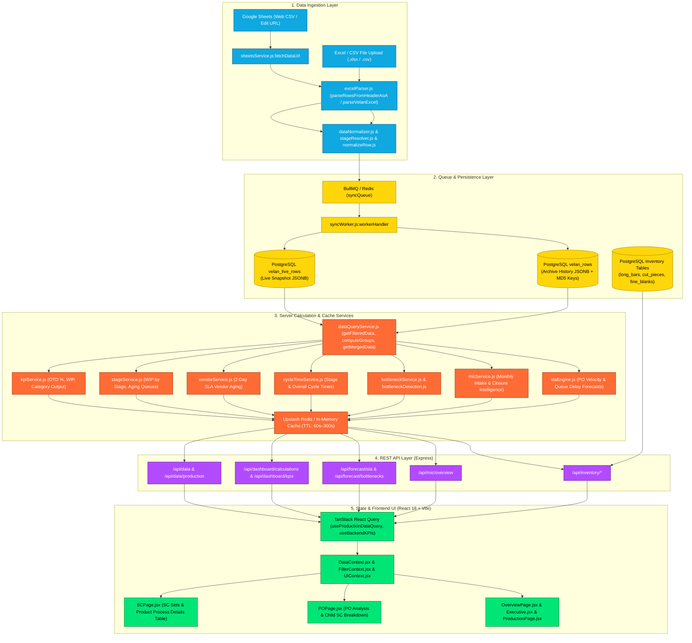
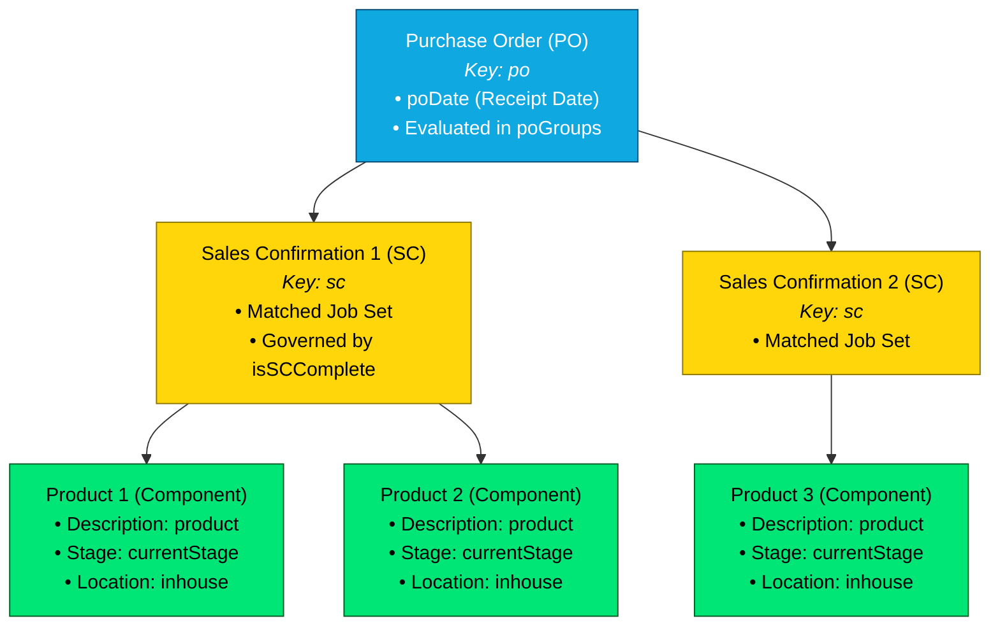
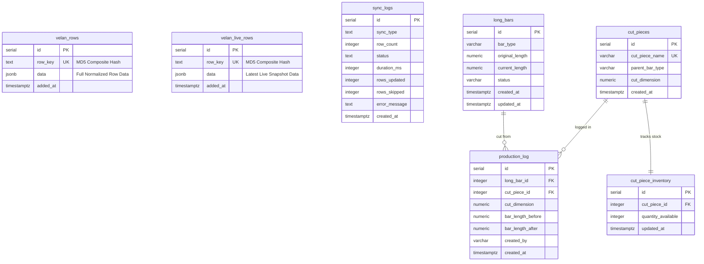
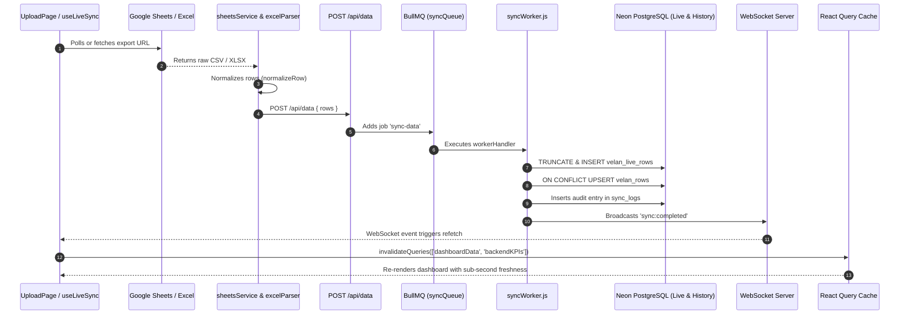
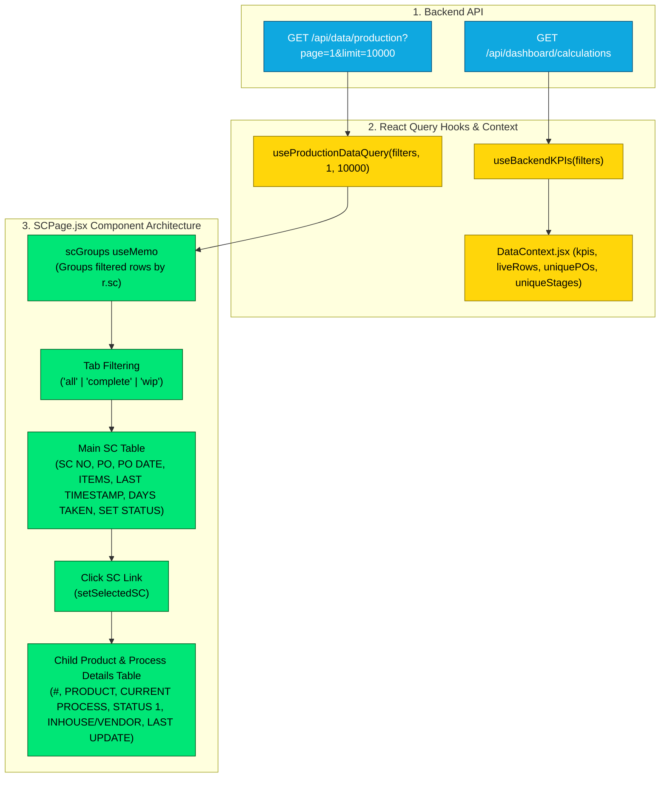
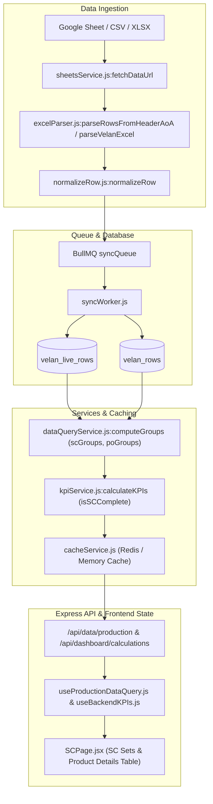

# Phase 0 — Current System Audit
## Velan Metrology Production Dashboard

---

## 1. Executive Summary

### 1.1 Purpose & Scope
This document constitutes the comprehensive **Phase 0 Current System Audit** for the **Velan Metrology Production Dashboard**. The purpose of this audit is to exhaustively analyze the existing codebase, reverse-engineer all data pipelines, database architectures, synchronization workflows, operational heuristics, and date calculation engines, and establish a rock-solid, grounded foundation for subsequent implementation phases.

### 1.2 Audit Constraints & Safety Enforcement
- **Audit-Only Phase:** Strictly zero code changes, refactors, schema migrations, or feature implementations have been introduced into the application.
- **Scope of Analysis:** Traced from raw Google Sheets / Excel ingestion through parser and normalizer services, BullMQ queues, PostgreSQL (Neon) storage, calculation services, REST APIs, TanStack React Query hooks, down to individual React component tables and KPI cards.
- **Future Date Concept Discovery:** Special emphasis was placed on auditing the three upcoming date requirements:
  1. **Product Projected Production Date:** Expected manufacturing completion date for individual workpieces.
  2. **Estimated Delivery:** Commercial/sales lead time calculation (~6–8 weeks from PO receipt).
  3. **SC Production Date:** SC-level aggregated date ($\max(\text{Product Projected Dates})$ across all products in a Sales Confirmation).

---

## 2. Current Architecture

The Velan Dashboard operates as a decoupled, multi-tier manufacturing execution and analytics system:



---

## 3. Project Structure

```
velan-dashboard-updated/
├── package.json                    # Dependencies: React 18, Vite 6, Express 4, pg, bullmq, ioredis, zod
├── vite.config.js                  # Vite configuration with React Babel plugin and proxy setup
├── server.js                       # Primary backend bootstrap (routes to src/server/server.js)
├── docs/                           # Technical documentation suite (01 to 26)
├── src/
│   ├── main.jsx                    # React client entry point
│   ├── App.jsx                     # Top-level Router & Context wrapper
│   ├── components/                 # Reusable UI components
│   │   ├── Header.jsx              # Navigation header
│   │   ├── Sidebar.jsx             # Left navigation sidebar (20 pages)
│   │   ├── KPICard.jsx             # Metric card renderer
│   │   ├── DataTable.jsx           # Generic tabular component
│   │   ├── FilterBar.jsx           # Global multi-criteria filter bar
│   │   ├── forecasting/            # SLA & Bottleneck forecast panels
│   │   └── vendor/                 # Vendor risk & aging tables
│   ├── context/                    # Global React Contexts
│   │   ├── AuthContext.jsx         # User session & RBAC
│   │   ├── DataContext.jsx         # Production data, live sync triggers, KPI hooks
│   │   ├── FilterContext.jsx       # Multi-criteria filter state
│   │   └── UIContext.jsx           # Modals, loading, and toast notifications
│   ├── hooks/                      # Custom React Query & API hooks
│   │   ├── useAuth.js              # Auth state hook
│   │   ├── useBackendKPIs.js       # React Query hook for /api/dashboard/calculations
│   │   ├── useDashboardData.js     # React Query hook for /api/data initial load
│   │   ├── useLiveSync.js          # Polling hook for automated background sync
│   │   ├── useProductionDataQuery.js # Paginated server-side query hook
│   │   └── useUploadHandlers.js    # Drag-and-drop & file parsing handlers
│   ├── pages/                      # 20 Application Views
│   │   ├── SCPage.jsx              # ★ SC Sets Completion & Product Process Details Table
│   │   ├── POPage.jsx              # PO Analysis & Order Progression
│   │   ├── OverviewPage.jsx        # Plant Overview Dashboard
│   │   ├── Executive.jsx           # Executive War Room KPIs
│   │   ├── ProductionPage.jsx      # Workstation WIP & Stage Queues
│   │   ├── VendorPage.jsx          # Subcontractor Risk Matrix & Aging
│   │   ├── PredictiveAnalyticsPage.jsx # Machine learning & queue forecasts
│   │   ├── InventoryPage.jsx       # Raw bar cutting & blank inventory
│   │   ├── MICPage.jsx             # Monthly Intake & Closure Analytics
│   │   └── UploadPage.jsx          # Manual spreadsheet upload & live URL config
│   ├── services/                   # Frontend & shared services
│   │   ├── apiClient.js            # Fetch client with cookie credentials & error interception
│   │   ├── dataNormalizer.js       # Typo maps, stage aliases, type inference, color badges
│   │   ├── excelParser.js          # SheetJS AoA parser, header probe, Velan merged-cell parser
│   │   ├── googleSheets.js         # Google Sheets URL normalizer & export link generator
│   │   ├── sheetsService.js        # Universal URL fetcher (proxied GSheets, CSV, XLSX)
│   │   └── stageResolver.js        # 3-tier cascade stage resolver (OP -> STATUS2 -> STATUS1)
│   ├── utils/                      # Core calculation and formatting utilities
│   │   ├── calculationUtils.cjs    # ★ Working days (Mon-Sat / Mon-Fri), holidays, SLA, isSCComplete
│   │   ├── chartUtils.js           # Chart.js helper wrappers
│   │   ├── dateUtils.js            # ★ toIsoDateString (DD/MM/YYYY vs MM/DD/YYYY resolution), fmtDate, fmtTs
│   │   ├── logger.js               # Structured logger
│   │   └── normalizeRow.js         # Single-row normalization bridge
│   └── server/                     # Express Backend Architecture
│       ├── app.js                  # Express middleware configuration, security headers, routes
│       ├── server.js               # HTTP + WebSocket listener initialization
│       ├── cache/                  # Redis caching service & cache key definitions
│       ├── db/                     # PostgreSQL pool & database query layers
│       │   ├── pool.js             # Table init (velan_rows, velan_live_rows, etc.), MD5 deduplication
│       │   └── queries/            # Drilldown and executive query builders
│       ├── forecast/               # Isolated forecasting engines
│       │   ├── bottleneckDetection.js # Net queue velocity & +14d projections
│       │   ├── capacityPlanner.js  # Stage throughput requirements
│       │   ├── plantRisk.js        # Holistic plant risk scoring
│       │   ├── queueForecast.js    # Per-workstation queue growth modeling
│       │   ├── slaEngine.js        # PO velocity & queue impact forecast
│       │   └── vendorRisk.js       # Vendor delay scoring
│       ├── queues/                 # BullMQ queue definitions (syncQueue, exportQueue)
│       ├── routes/                 # 23 Modular API routers
│       │   ├── data.js             # /api/data & /api/data/production
│       │   ├── dashboard.js        # /api/dashboard/calculations & /api/dashboard/kpis
│       │   ├── forecast.js         # /api/forecast/*
│       │   ├── inventory.js        # /api/inventory/* (ACID transactional bar cutting)
│       │   ├── mic.js              # /api/mic/overview
│       │   ├── sheets.js           # /api/sheets proxy
│       │   └── alerts.js           # /api/alerts/*
│       ├── schemas/                # Zod request validation schemas (upload, auth, user)
│       ├── services/               # Server-side business logic
│       │   ├── dataQueryService.js # Merged live/history querying & computeGroups (scGroups, poGroups)
│       │   ├── kpiService.js       # OTD %, WIP, output counters
│       │   ├── stageService.js     # Stage distributions & aging
│       │   ├── vendorService.js    # Vendor 2-day SLA violation detector
│       │   ├── cycleTimeService.js # Stage duration & PO cycle times
│       │   ├── micService.js       # Monthly Intake & Closure rolling windows
│       │   └── alertEngine.js      # Critical alert rules evaluator
│       └── workers/                # BullMQ background workers (syncWorker.js, exportWorker.js)
```

---

## 4. Excel / Google Sheet Source Structure

### 4.1 Ingestion Mechanisms
The system accepts raw manufacturing data through four input mechanisms:
1. **Google Sheets Web CSV / Share URL:** Fetched via backend proxy [`src/server/routes/sheets.js`](file:///c:/Users/Admin/OneDrive/Desktop/velan-dashboard-updated/src/server/routes/sheets.js) to prevent CORS blocks.
2. **Local `.xlsx` / `.xls` File Upload:** Parsed client-side via SheetJS in [`src/services/excelParser.js:parseWorksheet`](file:///c:/Users/Admin/OneDrive/Desktop/velan-dashboard-updated/src/services/excelParser.js#L302-L317).
3. **Raw `.csv` Upload:** Parsed with custom quotes-preserving tokenizer `parseRawCsv`.
4. **JSON API Import:** Direct ingestion of pre-structured rows via `POST /api/import`.

### 4.2 Sheet & Header Detection Cascade
When a workbook or CSV is received, `excelParser.js` executes the following header detection sequence:
1. **Header AoA Probe (`parseRowsFromHeaderAoA`):** Scans the first 40 rows of the sheet. Searches for column headers using exact and substring aliases for `sc`, `po`, `poDate`, `product`, `status1`, `status2`, `inhouse`, `op`, `timestamp`.
2. **Velan Legacy Template Detector (`parseVelanExcel`):** If the first 6 rows contain `'VELAN METROLOGY'` or `'SNO'`, switches to fixed positional indexing (Columns A through L) with merged-cell propagation.
3. **Generic Flat Parser (`parseGenericRows`):** Fallback for flat tabular sheets with normalized lowercase headers.

### 4.3 Merged Cell & Blank Propagation Rules
In hierarchical Velan production logs:
- Column C (`PO NO`), Column D (`PO RECD DATE`), and Column E (`SC`) are often only typed on the first row of an order set.
- `parseVelanExcel` maintains running state variables (`currentPO`, `currentPODate`, `currentSC`) and automatically propagates them down to all subsequent child component rows until a new PO/SC value is encountered.

---

## 5. Column → Internal Field Mapping

| Source Column Header | Column Index | Aliases in `excelParser.js` | Parser Object Key | Normalized Field (`normalizeRow.js`) | Database JSON Path (`velan_rows.data`) | Required? | Notes |
| :--- | :---: | :--- | :--- | :--- | :--- | :---: | :--- |
| `SNO` | Col A (0) | `sno`, `s.no`, `sl.no` | `sno` | *Ignored* | *Not indexed* | No | Row sequence counter |
| `TARGET DATE` | Col B (1) | `target date`, `targetdate`, `due date` | *Not mapped* | *Not mapped* | *Not mapped* | No | Customer contractual target date (See §7) |
| `PO NO` | Col C (2) | `pono`, `po no`, `purchase order`, `purchaseorder` | `po` | `po` | `data->>'po'` | **Yes** | Alphanumeric PO code |
| `PO RECD DATE` | Col D (3) | `porecddate`, `po recd date`, `po date`, `podate`, `date received`, `date` | `poDate` | `poDate` | `data->>'poDate'` | **Yes** | ISO `YYYY-MM-DD` string |
| `SC` | Col E (4) | `sc`, `sc no`, `sc#`, `scno` | `sc` | `sc` | `data->>'sc'` | **Yes** | Spaces stripped (e.g. `SC4401`) |
| `Product Name` | Col F (5) | `product name`, `productname`, `product`, `item description`, `description` | `product` | `product` | `data->>'product'` | **Yes** | Product description string |
| `QTY` | Col G (6) | `qty`, `quantity` | `qty` | `qty` | `data->>'qty'` | No | Batch quantity (defaults to 1) |
| `STATUS 1` | Col H (7) | `status 1`, `status1`, `current operation`, `operation` | `status1` | `status1` | `data->>'status1'` | No | Operator machining notes |
| `STATUS 2` | Col I (8) | `status 2`, `status2`, `next operation` | `status2` | `status2` | `data->>'status2'` | No | Movement / transfer notes |
| `INHOUSE/VENDOR` | Col J (9) | `inhouse/ vendor`, `inhouse/vendor`, `inhousevendor`, `location`, `vendor status` | `inhouse` | `inhouse` | `data->>'inhouse'` | No | `'INHOUSE'` or `'VENDOR'` |
| `OP` | Col K (10) | `op`, `currentstage`, `current stage`, `stage`, `operation stage` | `opStage` | `currentStage` | `data->>'currentStage'` | **Yes** | Normalized workstation stage |
| `OP UPDATED DATE` | Col L (11) | `timestamp`, `time stamp`, `last updated`, `op time`, `datetime` | `timestamp` | `timestamp` | `data->>'timestamp'` | No | ISO Datetime string |
| **FAMILY** | *N/A* | *None* | *None* | `type` | `data->>'type'` | Dynamic | Inferred via `inferType(product)` (`APG`, `ARG`, `SPG`, `SRG`, `SP`, `ACCESSORY`) |
| **PROCESS TEMPLATE** | *N/A* | *None* | *None* | *None* | *None* | No | *Not present in codebase* |
| **PROJECTED DATE** | *N/A* | *None* | *None* | *None* | *None* | No | *Not currently parsed from source* (See §6) |
| **ESTIMATED DELIVERY**| *N/A* | *None* | *None* | *None* | *None* | No | *Not currently present in source* (See §7) |

---

## 6. Projected Date Current Logic

### 6.1 Audit Findings for Product Projected Production Date
An exhaustive search across the entire project for all references to `PROJECTED DATE`, `projectedDate`, `expected completion`, and `projection` reveals the following:

1. **Import Status:** Product-level Projected Date is **NOT imported** from Excel or Google Sheets. Neither `parseRowsFromHeaderAoA`, `parseVelanExcel`, nor `parseGenericRows` contains any alias or mapping for a product-level projected date column.
2. **Application Calculation:** Product-level Projected Date is **NOT calculated** inside the application. (The forecasting engine in `src/server/forecast/slaEngine.js` only computes a statistical `projectedCompletionDate` at the aggregate PO level).
3. **Manual Entry:** There is **NO manual entry** UI or API for setting product projected dates.
4. **Database Storage:** Product-level Projected Date is **NOT stored** in PostgreSQL (`velan_rows` or `velan_live_rows`).
5. **API & Frontend Exposure:** No API endpoint returns a product-level projected date. `SCPage.jsx` does **NOT** display a projected date column.
6. **Multi-Row / Duplicate Handling:** In `src/server/services/dataQueryService.js:computeGroups`, items under an SC are deduplicated by `product` name. If duplicate rows exist, the system selects the row with `_isLive: true` precedence or the latest `timestamp`.

---

## 7. Estimated Delivery Current Logic

### 7.1 Audit Findings for Commercial Estimated Delivery
An exhaustive search across the codebase for `estimatedDelivery`, `ESTIMATED_DELIVERY`, `6 WEEK`, `8 WEEK`, `42 days`, and `56 days` confirms:

1. **Existing Commercial Calculation:** There is **NO 6–8 week commercial delivery calculation** in the current codebase.
2. **Current SLA Engine Lead Time:** The existing system models delivery deadlines exclusively using a **21-working-day manufacturing SLA clock** anchored to `poDate` ([`src/utils/calculationUtils.cjs:TARGET_DAYS = 21`](file:///c:/Users/Admin/OneDrive/Desktop/velan-dashboard-updated/src/utils/calculationUtils.cjs#L5)):
   $$\text{Contractual SLA Deadline} = \text{addWorkingDays5Day}(\text{poDate}, 21)$$
3. **Weekend & Holiday Inclusions:** The existing 21-day SLA calculation skips Sundays and 12 predefined Tamil Nadu company holidays (in `calculationUtils.cjs`), but does **NOT** calculate commercial 6–8 calendar/working week delivery dates.
4. **Conclusion & Status:** The 6–8 week Estimated Delivery concept is a **NEW commercial feature** that does not exist in the current codebase and must be designed during subsequent phases.

---

## 8. PO → SC → Product Hierarchy

### 8.1 Hierarchy Model
The application models a strict 3-tier hierarchy:



### 8.2 Grouping & Deduplication Algorithms
- **SC Group Construction ([`src/server/services/dataQueryService.js:computeGroups`](file:///c:/Users/Admin/OneDrive/Desktop/velan-dashboard-updated/src/server/services/dataQueryService.js#L131-L163)):**
  1. Gathers all rows sharing an `sc` identifier into `scGroupsMap[sc]._all`.
  2. Applies `normalizeProductsInGroup` to resolve truncated product descriptions (e.g. `"APG DIA 12.000 MM ..."` matched against full descriptions in the group).
  3. Builds `latestMap` keyed by `(product)`. Resolves duplicates by selecting `_isLive: true` rows over historical rows, or taking the newest `timestamp`.
- **Set Integrity Rule (`isSCComplete` in `src/utils/calculationUtils.cjs`):**
  $$\text{isSCComplete}(\text{items}) \iff \forall i \in \text{items}, i.\text{currentStage} \in \{\texttt{'READY'}, \texttt{'STORES'}, \texttt{'STOCK'}, \texttt{'EXSTOCK'}, \texttt{'VA'}\}$$
  If even a single component is in `CG` or `LATHE`, the entire SC remains **IN PROGRESS (WIP)**.

---

## 9. SC Calculation Logic

| Metric / Calculation | Code Location | Mathematical Formula / Logic | Stored in DB? | Exposed in API? | UI Component |
| :--- | :--- | :--- | :---: | :---: | :--- |
| **SC Completion Flag** | `calculationUtils.cjs:isSCComplete` | $\forall i \in \text{items}, i.\text{currentStage} \in \text{Terminal Set}$ | No (Calculated in-memory) | `GET /api/dashboard/kpis`<br/>`res.completeSets` | `SCPage.jsx` (Status Pill: `COMPLETE` vs `IN PROGRESS`) |
| **SC Last Activity Timestamp** | `calculationUtils.cjs:getSCLastTimestamp` | $\max_{i \in \text{items}}(i.\text{timestamp})$ | No | Embedded in SC objects | `SCPage.jsx` (`LAST TIMESTAMP` column) |
| **SC Days Taken / Aging** | `calculationUtils.cjs:daysBetween` | $\text{workingDaysBetween}(\text{poDate}, \text{lastTs})$ | No | Embedded in SC objects | `SCPage.jsx` (`DAYS TAKEN` column) |
| **SC Set Count** | `kpiService.js:calculateKPIs` | Count of unique `sc` keys in dataset | No | `res.completeSets`, `res.readySets` | `SCPage.jsx` (Top KPI Cards) |
| **SC Production Date** | *None* | **DOES NOT CURRENTLY EXIST** | **No** | **No** | **Not Present** |

> [!IMPORTANT]
> **Audit Declaration on SC Production Date:**
> **"SC Production Date calculation does not currently exist in the application codebase."**
> Currently, SC rows only track the historical `LAST TIMESTAMP` (`max(item.timestamp)` of past updates) and `DAYS TAKEN` since `poDate`.

---

## 10. Status / Operation Mapping

### 10.1 The 3-Tier Resolution Cascade ([`src/services/stageResolver.js`](file:///c:/Users/Admin/OneDrive/Desktop/velan-dashboard-updated/src/services/stageResolver.js))
When resolving the active manufacturing workstation for any component:
1. **Tier 1 (Primary):** Evaluates Column K (`OP`) through `normalizeStage(opStage)`.
2. **Tier 2 (Fallback 1):** Scans Column I (`STATUS2`) with `extractStageFromStatusText(status2)`.
3. **Tier 3 (Fallback 2):** Scans Column H (`STATUS1`) with `extractStageFromStatusText(status1)`.
4. **Tier 4 (Default):** Returns `''` (Unresolved).

### 10.2 Regex Pattern Matching
- **Movement Directive:** `t.match(/MOVE\s*TO\s*([A-Z0-9]+)/)` extracts target workstation token.
- **Terminal Keywords:** `/\bSTOCK\b/`, `/\bSTORES?\b/`, `/\bREADY\b/`.
- **Known Stage Substring Array:** Matches against `['LATHE', 'M1', 'FB', 'HT', 'SZ', 'BLK', 'CG', 'SG', 'SD', 'HO', 'CA', 'WC', 'VA', 'QC', 'DCPLI', 'FBV', 'BLV', 'SDV', 'HOV', 'HTV', 'HCV', 'RM']`.

### 10.3 Typo Correction Dictionary ([`src/services/dataNormalizer.js`](file:///c:/Users/Admin/OneDrive/Desktop/velan-dashboard-updated/src/services/dataNormalizer.js))
- `STORE`, `STORRES`, `STOERS` $\to \texttt{'STORES'}$
- `READDY`, `REAADY` $\to \texttt{'READY'}$
- `BLACKENEING`, `BLACKNING`, `BLACKENNING` $\to \texttt{'BLACKENING'}$
- `CALIBARTION`, `CALLIBRATION` $\to \texttt{'CALIBRATION'}$
- `DCPL` $\to \texttt{'DCPLI'}$

### 10.4 Vendor Suffix `'V'` Convention
- Any workstation code ending with `'V'` (`FBV`, `BLV`, `HTV`, `HCV`, `HOV`, `SDV`) automatically maps to `inhouse = 'VENDOR'` and enforces the **2-working-day subcontractor SLA threshold**.

---

## 11. Date Handling

### 11.1 Date Parsing Architecture ([`src/utils/dateUtils.js`](file:///c:/Users/Admin/OneDrive/Desktop/velan-dashboard-updated/src/utils/dateUtils.js))
- **Primary Function:** `toIsoDateString(value)`
- **Ambiguous Date Resolution (`_resolveSlashDate`):** When encountering ambiguous dates with slashes or dashes where both parts $\le 12$ (e.g. `05/09/2026`):
  - **Indian / Velan Standard:** Explicitly resolves as **`DD/MM/YYYY`** ($\implies \texttt{'2026-09-05'}$).
  - Unambiguous dates (e.g. `15/09/2026` or `09/15/2026`) are automatically resolved correctly.
- **Excel Serial Date Handling:** Detects numeric serial timestamps ($20000 < \text{num} < 80000$) and converts via epoch offset $(num - 25569) \times 86400 \times 1000$.

### 11.2 Working Day & Holiday Engine ([`src/utils/calculationUtils.cjs`](file:///c:/Users/Admin/OneDrive/Desktop/velan-dashboard-updated/src/utils/calculationUtils.cjs))
- **Standard Working Days (`workingDaysBetween`):** 6-day work week (Monday–Saturday). Sunday (`getDay() === 0`) and 12 predefined Tamil Nadu company holidays are excluded.
- **5-Day Forecasting Engine (`workingDaysBetween5Day`, `addWorkingDays5Day`):** 5-day work week (Monday–Friday). Saturdays, Sundays, and company holidays are excluded.

---

## 12. Database Structure



### 12.1 Database Role & Live-Row Precedence
- **Mixed Store Model:** 
  - `velan_live_rows`: Serves as the **Live Operational Snapshot**. On each synchronization, it is completely truncated and re-populated with active rows.
  - `velan_rows`: Serves as the **Permanent Historical Archive**. Deduplicated via composite MD5 hash (`makeKey` in `pool.js`).
- **Live Precedence Rule ([`src/server/services/dataQueryService.js:computeGroups`](file:///c:/Users/Admin/OneDrive/Desktop/velan-dashboard-updated/src/server/services/dataQueryService.js#L154-L160)):**
  When grouping rows for an SC or PO:
  $$\text{If } row_A.\_isLive = \text{true} \land row_B.\_isLive = \text{false} \implies \text{Select } row_A$$
  Live Google Sheet entries **always override** historical database rows.

---

## 13. Data Synchronization



---

## 14. Backend API Data Flow

| Route & Method | Responsible Service | Database Query / Source | Response Structure | Frontend Consumer Hook / Component |
| :--- | :--- | :--- | :--- | :--- |
| `GET /api/data/production` | `dataQueryService.js:getFilteredData` | `getAllRawData()` (cached 60s) $\to$ `velan_live_rows` + `velan_rows` | `{ rows: RowItem[], total: number, page, limit, totalPages }` | `useProductionDataQuery.js`<br/>`SCPage.jsx`, `POPage.jsx`, `DataTable.jsx` |
| `GET /api/dashboard/calculations` | `dashboard.js` (orchestrates `kpiService`, `stageService`, `cycleTimeService`, `vendorService`, `bottleneckService`) | `getMergedData()` + `computeGroups()` | Consolidated JSON with all KPIs, stage WIP, bottleneck scores, vendor aging | `useBackendKPIs.js`<br/>`Executive.jsx`, `OverviewPage.jsx`, `ProductionPage.jsx` |
| `GET /api/dashboard/kpis` | `kpiService.js:calculateKPIs` | `getMergedData()` + `computeGroups()` | `{ totalItems, ready, stores, wip, onTime, delayed, onTimePct, completeSets, ... }` | `useBackendKPIs.js`<br/>`KPICard.jsx` across all pages |
| `GET /api/forecast/sla` | `slaEngine.js:calculateSLAForecast` | `getAllRawData()` | `{ forecasts: [{ poNumber, projectedCompletionDate, expectedDelay, riskLevel, ... }], metadata }` | `SLAForecastPanel.jsx`<br/>`PredictiveAnalyticsPage.jsx` |
| `GET /api/inventory/stock` | `inventory.js` | `SELECT * FROM cut_piece_inventory JOIN cut_pieces` | `[{ id, quantityAvailable, cutPiece: { cutPieceName, cutDimension } }]` | `InventoryPage.jsx` |

---

## 15. React Query / Frontend Data Flow



---

## 16. Current SC Page Architecture

### 16.1 Component Specifications ([`src/pages/SCPage.jsx`](file:///c:/Users/Admin/OneDrive/Desktop/velan-dashboard-updated/src/pages/SCPage.jsx))
- **File:** `src/pages/SCPage.jsx`
- **Data Hook:** `const { rows: filtered } = useProductionDataQuery(filters, 1, 10000);`
- **State Management:**
  - `tab`: `'all'` | `'complete'` | `'wip'`
  - `selectedSC`: Active SC object selected for product drilldown
  - `search`: Local filter string for SC, PO, or Product name

### 16.2 Main SC Table (Lines 134–205)
Columns rendered:
1. `SC NO`: Clickable button invoking `setSelectedSC(sg)`
2. `PO`: Customer PO reference
3. `PO DATE`: Formatted via `fmtDate(sg.poDate)`
4. `ITEMS`: Count of constituent workpiece rows (`sg.items.length`)
5. `LAST TIMESTAMP`: Formatted via `fmtTs(lastTs)`
6. `DAYS TAKEN`: Elapsed working days calculated via `daysBetween(sg.poDate, lastTs)`
7. `SET STATUS`: Badge rendering `COMPLETE` (green) if `isSCComplete(sg.items)` is true, else `IN PROGRESS` (amber)

### 16.3 Child Product & Process Details Table (Lines 240–310)
Rendered when `selectedSC !== null`:
1. `#`: Sequential index (`idx + 1`)
2. `PRODUCT`: Product description (`item.product`)
3. `CURRENT PROCESS`: Workstation badge colored by `getStageColor(item.currentStage)`
4. `STATUS 1`: Free-text operator machining notes (`item.status1`)
5. `INHOUSE/VENDOR`: Location pill (`item.inhouse`)
6. `LAST UPDATE`: Formatted timestamp (`fmtTs(item.timestamp)`)

### 16.4 Safest Insertion Points for Future Date Features
- **Product Projected Production Date:** Insert as a new column between `CURRENT PROCESS` and `STATUS 1` (or after `LAST UPDATE`) in the Child Product Table (Line 250).
- **Estimated Delivery:** Insert in the Main SC Table metadata banner (Line 221) and as an optional column in the main table.
- **SC Production Date:** Insert in the Main SC Table header (Line 144) as `SC PROD DATE` and in the child modal summary header (Line 223).

---

## 17. Existing Business Rules

| Rule ID | Rule Name | Code Reference | Confirmed Implementation Logic | Discrepancies / Notes |
| :--- | :--- | :--- | :--- | :--- |
| `BR-PO-001` | 21-Working-Day SLA | `calculationUtils.cjs:5` | Order delivery target is programmatically calculated as $\text{poDate} + 21\text{ working days}$. | Static spreadsheet `TARGET DATE` is currently secondary to this calculation. |
| `BR-VN-001` | 2-Day Vendor SLA | `vendorService.js:calculateVendors` | Subcontract vendor stages (`*V` or `inhouse === 'VENDOR'`) trigger SLA violation if aging $> 2\text{ working days}$. | Strictly enforced across vendor alerts. |
| `BR-SC-001` | Strict Matched Set Integrity | `calculationUtils.cjs:isSCComplete` | SC is complete if and only if **100% of member components** are in terminal stages (`READY`, `STORES`, `STOCK`, `EXSTOCK`, `VA`). | Confirmed; partial sets remain in WIP. |
| `BR-CAL-001`| Sunday & Holiday Calendar | `calculationUtils.cjs:COMPANY_HOLIDAYS` | Sundays and 12 predefined regional Tamil Nadu company holidays are excluded from working days. | Confirmed in date calculations. |
| `BR-CAL-003`| 6-Day vs 5-Day Calendar | `calculationUtils.cjs` | Operational KPIs use 6-day week (Mon–Sat); Forecasting modules use 5-day week (Mon–Fri). | Architectural distinction between plant operations and conservative forecasts. |
| `BR-INV-001`| Pessimistic Bar Locking | `inventory.js:174` | Raw bar cutting executes under PostgreSQL `SELECT ... FOR UPDATE` row locks. | Prevents concurrent material over-allocation. |
| `BR-SYNC-002`| Live Row Precedence | `dataQueryService.js:154` | Live Google Sheet rows take precedence over historical database rows. | Confirmed during deduplication. |

---

## 18. Potential Conflicts / Risks

1. **Risk 1: Ambiguity Between Manufacturing Projected Date and Commercial Delivery Date**
   - *Nature of Risk:* Operators or sales staff might conflate the **Product Projected Production Date** (shop-floor manufacturing completion) with the **Estimated Delivery Date** (commercial customer delivery target, ~6–8 weeks).
   - *Mitigation:* Ensure strict naming conventions and separate visual sections on both the frontend and backend API contracts.
2. **Risk 2: Discrepancy Between 5-Day and 6-Day Working Calendars**
   - *Nature of Risk:* `calculationUtils.cjs` contains two distinct functions: `workingDaysBetween` (skips Sunday only) and `workingDaysBetween5Day` (skips Saturday and Sunday).
   - *Mitigation:* Clarify whether date projection additions must adhere to the 6-day plant manufacturing calendar or the 5-day commercial calendar.
3. **Risk 3: Merged-Cell Blank Rows in Hierarchical Spreadsheets**
   - *Nature of Risk:* When new date columns are added to Google Sheets, editors might populate the projected date only on the primary row, leaving sub-component rows blank.
   - *Mitigation:* Explicitly verify whether projected dates must be inherited down blank merged rows or evaluated per individual component.
4. **Risk 4: Live Snapshot Truncation Overwrite**
   - *Nature of Risk:* `saveLiveRows` truncates `velan_live_rows` on every sync. If a projected date is only calculated in-memory and not stored or parsed from source, it will be lost upon re-sync.
   - *Mitigation:* Ensure projected dates are cleanly ingested from source columns or persisted in `data` JSONB.

---

## 19. Complete Date Data Lineage

| Business Concept | Source | Source Column | Parser Field | Normalized Field | DB Field (`data` JSONB) | Service | API Route | React Hook | Target UI Component | Status |
| :--- | :--- | :--- | :--- | :--- | :--- | :--- | :--- | :--- | :--- | :---: |
| **PO Received Date** | Sheet / File | Col D (`PO RECD DATE`) | `poDate` | `poDate` | `data->>'poDate'` | `dataQueryService.js` | `GET /api/data/production` | `useProductionDataQuery` | `SCPage.jsx` (`PO DATE`), `POPage.jsx` | **EXISTS** |
| **Last Operation Timestamp** | Sheet / File | Col L (`OP UPDATED DATE`) | `timestamp` | `timestamp` | `data->>'timestamp'` | `kpiService.js`, `stageService.js` | `GET /api/data/production` | `useProductionDataQuery` | `SCPage.jsx` (`LAST UPDATE`) | **EXISTS** |
| **Contractual SLA Due Date (21d)** | Programmatic | *Derived from Col D* | *None* | *None* | *Calculated* | `slaEngine.js`, `kpiService.js` | `GET /api/forecast/sla` | `useBackendKPIs` | `SLAForecastPanel.jsx`, `Executive.jsx` | **EXISTS** |
| **1. Product Projected Production Date** | Sheet / File | *Future Excel Column* | *To be added* | *To be added* | `data->>'projectedDate'` | `dataQueryService.js` | `GET /api/data/production` | `useProductionDataQuery` | `SCPage.jsx` (Child Product Table) | **FUTURE (DOES NOT EXIST)** |
| **2. Estimated Delivery (6–8 Wk)** | Programmatic / Commercial | *Derived from PO Date* | *To be added* | *To be added* | *Calculated / Stored* | `cycleTimeService.js` | `GET /api/dashboard/calculations` | `useBackendKPIs` | `SCPage.jsx`, `POPage.jsx` | **FUTURE (DOES NOT EXIST)** |
| **3. SC Production Date** | Computed Aggregate | $\max(\text{Product Projected Dates})$ | *None* | *None* | *Calculated in scGroups* | `dataQueryService.js`, `kpiService.js` | `GET /api/data/production` | `useProductionDataQuery` | `SCPage.jsx` (Main SC Sets Table) | **FUTURE (DOES NOT EXIST)** |

---

## 20. Current System Architecture Diagram



---

## 21. Future Feature Integration Points

### Feature A: Product Projected Production Date
- **SOURCE:** Dedicated column in Google Sheets / Excel (e.g. Column M/N/O titled `PROJECTED DATE`, `MFG DUE DATE`, or `TARGET COMPLETION`).
- **PARSER:** [`src/services/excelParser.js`](file:///c:/Users/Admin/OneDrive/Desktop/velan-dashboard-updated/src/services/excelParser.js) (`parseRowsFromHeaderAoA`, `parseVelanExcel`, `parseGenericRows`).
- **NORMALIZER:** [`src/utils/normalizeRow.js`](file:///c:/Users/Admin/OneDrive/Desktop/velan-dashboard-updated/src/utils/normalizeRow.js) & [`src/services/dataNormalizer.js`](file:///c:/Users/Admin/OneDrive/Desktop/velan-dashboard-updated/src/services/dataNormalizer.js) (parse via `toIsoDateString`).
- **SCHEMA:** [`src/server/schemas/upload.schema.js`](file:///c:/Users/Admin/OneDrive/Desktop/velan-dashboard-updated/src/server/schemas/upload.schema.js) (`rowSchema`).
- **DATABASE:** Persisted in `data` JSONB (`data->>'projectedDate'`) in `velan_live_rows` and `velan_rows`.
- **SERVICE:** Grouped into product items in [`src/server/services/dataQueryService.js:computeGroups`](file:///c:/Users/Admin/OneDrive/Desktop/velan-dashboard-updated/src/server/services/dataQueryService.js).
- **API:** Returned in `rows[]` via `GET /api/data/production`.
- **REACT QUERY:** Ingested by `useProductionDataQuery`.
- **UI:** Displayed in [`src/pages/SCPage.jsx`](file:///c:/Users/Admin/OneDrive/Desktop/velan-dashboard-updated/src/pages/SCPage.jsx) inside the Child Product Details Table (Line 250).

---

### Feature B: Estimated Delivery (Commercial Calculation)
- **INPUT / SOURCE:** Anchored to `poDate` (Column D).
- **CALCULATION LOCATION:** [`src/utils/calculationUtils.cjs`](file:///c:/Users/Admin/OneDrive/Desktop/velan-dashboard-updated/src/utils/calculationUtils.cjs) (e.g. `calculateEstimatedDelivery(poDate)`).
- **SERVICE:** [`src/server/services/kpiService.js`](file:///c:/Users/Admin/OneDrive/Desktop/velan-dashboard-updated/src/server/services/kpiService.js) and `dataQueryService.js`.
- **API:** Transmitted via `GET /api/dashboard/calculations` and embedded in `poGroups` / `scGroups`.
- **REACT QUERY:** Handled by `useBackendKPIs` and `useProductionDataQuery`.
- **UI:** Displayed in `POPage.jsx`, `SCPage.jsx` metadata headers, and `Executive.jsx`.

---

### Feature C: SC Production Date (Set Aggregate)
- **INPUT:** Array of child product `projectedDate` values under the Sales Confirmation.
- **CALCULATION FORMULA:**
  $$\text{SC Production Date} = \max_{p \in \text{SC.items} \land \text{isValidDate}(p.\text{projectedDate})}(p.\text{projectedDate})$$
- **CALCULATION LOCATION:** [`src/server/services/dataQueryService.js:computeGroups`](file:///c:/Users/Admin/OneDrive/Desktop/velan-dashboard-updated/src/server/services/dataQueryService.js) and [`src/utils/calculationUtils.cjs`](file:///c:/Users/Admin/OneDrive/Desktop/velan-dashboard-updated/src/utils/calculationUtils.cjs).
- **API:** Included as a top-level property on `scGroups` returned by `GET /api/data/production` and `GET /api/dashboard/calculations`.
- **REACT QUERY:** Ingested by `useProductionDataQuery`.
- **UI:** Rendered in [`src/pages/SCPage.jsx`](file:///c:/Users/Admin/OneDrive/Desktop/velan-dashboard-updated/src/pages/SCPage.jsx) in the Main SC Sets Table (Line 144) as `SC PROD DATE`.

---

## 22. Do Not Change List

The following existing architectures and business logic must be safeguarded and preserved without alteration during subsequent implementation phases:

1. **SC Matched Set Integrity (`isSCComplete` in `calculationUtils.cjs`):** SC completion must strictly remain an "all-or-nothing" rule requiring 100% of member components to be in terminal stages.
2. **3-Tier Stage Resolution Cascade (`stageResolver.js`):** The precedence order (`OP` $\to$ `STATUS2` $\to$ `STATUS1`) must remain intact to preserve operator note parsing.
3. **Typo Correction & Alias Dictionary (`dataNormalizer.js`):** All existing stage spellings (`READDY`, `STORRES`, `BLACKNING`, etc.) must remain active.
4. **Live Row Precedence Rule (`dataQueryService.js`):** In `computeGroups`, live rows (`_isLive: true`) must always supersede historical archive rows.
5. **Product Description Truncation Resolver (`normalizeProductsInGroup`):** Ellipsis resolution for long descriptions must be maintained to prevent split product grouping.
6. **ACID Concurrency Row Locks in Inventory (`inventory.js`):** `SELECT ... FOR UPDATE` locks on raw material cutting must remain untouched.
7. **2-Day Vendor SLA Limit (`vendorService.js`):** Subcontractor aging violations $> 2\text{ working days}$ must remain strictly functional.
8. **Indian Date Format Resolution Rule (`dateUtils.js`):** Ambiguous slash dates where both parts $\le 12$ must continue defaulting to `DD/MM/YYYY`.

---

## 23. Needs Business Verification Register

| ID | Business Question | Current Code Behavior | Code Reference | Business Impact |
| :---: | :--- | :--- | :--- | :--- |
| **BV-01** | Should an explicit `TARGET DATE` in Column B override the programmatic 21-day SLA calculation? | Current code ignores Column B for OTD calculations and enforces $\text{poDate} + 21\text{ working days}$. | `src/services/excelParser.js`<br/>`src/server/services/kpiService.js` | Direct impact on official On-Time Delivery (OTD %) metrics. |
| **BV-02** | Is Saturday a working day for date projection and delivery calculations? | Operational KPIs use 6-day week (Mon–Sat); Forecasting uses 5-day week (Mon–Fri). | `src/utils/calculationUtils.cjs#L104`<br/>`src/utils/calculationUtils.cjs#L353` | Projected dates will differ by 1–2 calendar days per week. |
| **BV-03** | Is the 6–8 week Estimated Delivery calculation based on calendar weeks (42–56 calendar days) or working weeks (36–48 working days)? | No 6–8 week calculation currently exists in code. | `src/utils/calculationUtils.cjs` | Dictates the formula for commercial customer delivery estimates. |
| **BV-04** | Should Estimated Delivery be displayed as a single date (e.g. $\text{poDate} + 42\text{ days}$) or as an explicit range (e.g. "15/10/2026 – 29/10/2026")? | N/A (New feature). | N/A | UI layout and data model representation on SC and PO pages. |
| **BV-05** | What should happen when an individual product in an SC has a blank / missing Projected Date? | N/A (Currently no projected date column is parsed). | `src/services/excelParser.js` | UI fallback badge (`"—"` vs `"UNSCHEDULED"`). |
| **BV-06** | What should happen when some products in an SC have Projected Dates and others do not? | N/A. | `src/server/services/dataQueryService.js` | Should SC Production Date calculate `MAX` over available dates or display a warning? |
| **BV-07** | What should happen when ALL products in an SC have no Projected Date? | N/A. | `src/pages/SCPage.jsx` | SC Production Date should display `"—"` or fallback to PO SLA date. |
| **BV-08** | Should completed / `READY` products with blank Projected Dates participate in the SC Production Date calculation? | N/A. | `src/utils/calculationUtils.cjs` | If a finished product has no projected date, it should not prevent an SC from computing a date for remaining WIP items. |
| **BV-09** | If the spreadsheet contains duplicate rows for the same product, which projected date should be chosen? | System currently selects the live row or newest timestamp row. | `src/server/services/dataQueryService.js#L154` | Guarantees deterministic date selection. |
| **BV-10** | Should SC Production Date be stored in PostgreSQL or computed dynamically in memory? | System currently computes set-level metrics dynamically in `computeGroups`. | `src/server/services/dataQueryService.js` | Database schema design vs in-memory calculation efficiency. |

---

## 24. Recommended Phase 1 Starting Point

### 24.1 Target Files for Phase 1
When Phase 1 is authorized, implementation should proceed in the following strict order:

1. **File 1: [`src/services/excelParser.js`](file:///c:/Users/Admin/OneDrive/Desktop/velan-dashboard-updated/src/services/excelParser.js)**
   - Add header detection aliases for `projectedDate` (`'projected date'`, `'projecteddate'`, `'mfg due date'`, `'target completion'`).
   - Extract `projectedDate` in `parseRowsFromHeaderAoA`, `parseVelanExcel`, and `parseGenericRows`.
2. **File 2: [`src/utils/normalizeRow.js`](file:///c:/Users/Admin/OneDrive/Desktop/velan-dashboard-updated/src/utils/normalizeRow.js)**
   - Pass `projectedDate: toIsoDateString(raw.projectedDate)` into normalized row output.
3. **File 3: [`src/server/schemas/upload.schema.js`](file:///c:/Users/Admin/OneDrive/Desktop/velan-dashboard-updated/src/server/schemas/upload.schema.js)**
   - Add `projectedDate: flexField` to Zod `rowSchema`.
4. **File 4: [`src/utils/calculationUtils.cjs`](file:///c:/Users/Admin/OneDrive/Desktop/velan-dashboard-updated/src/utils/calculationUtils.cjs)**
   - Add `calculateSCProductionDate(items)` to compute $\max(\text{projectedDate})$.
   - Add `calculateEstimatedDelivery(poDate)` based on business verification outcome.
5. **File 5: [`src/server/services/dataQueryService.js`](file:///c:/Users/Admin/OneDrive/Desktop/velan-dashboard-updated/src/server/services/dataQueryService.js)**
   - In `computeGroups`, calculate `scProductionDate` and `estimatedDelivery` on each `scGroup`.
6. **File 6: [`src/pages/SCPage.jsx`](file:///c:/Users/Admin/OneDrive/Desktop/velan-dashboard-updated/src/pages/SCPage.jsx)**
   - Add `SC PROD DATE` column to the Main SC Sets Table.
   - Add `PROJECTED DATE` column to the Child Product Details Table.

### 24.2 Verification & Test Requirements for Phase 1
- Unit tests in `src/__tests__/utils/calculationUtils.test.js` verifying `calculateSCProductionDate` with empty, partial, and full date arrays.
- End-to-end ingestion test verifying that spreadsheet rows with `PROJECTED DATE` persist through `syncQueue` into `velan_live_rows`.
- UI rendering verification ensuring that missing dates render graceful fallback placeholders (`"—"`).
