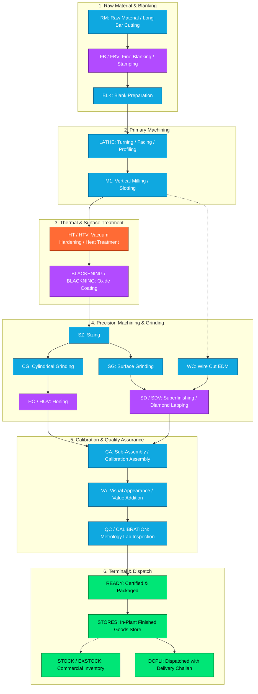
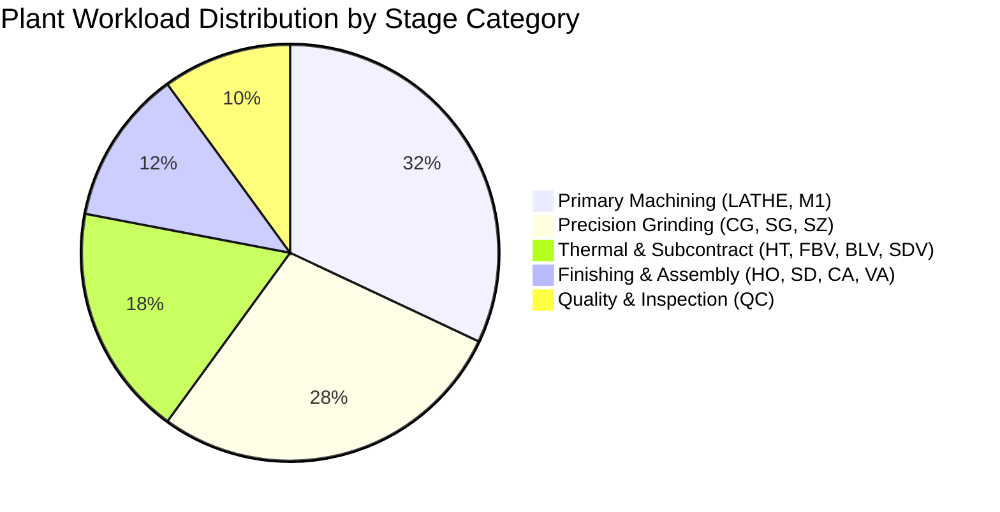
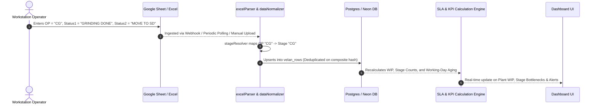
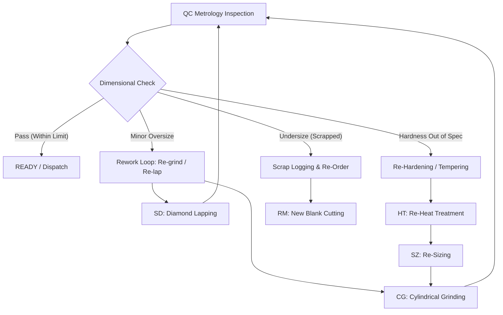

# 22 - Velan Metrology Production Workflow & Manufacturing Lifecycle

## 1. Purpose & Scope

This document provides the definitive technical and operational breakdown of the manufacturing lifecycle for high-precision metrology gauges and tooling produced by **Velan Metrology**. It details the sequential operational stages, workstation capabilities, inhouse vs. subcontracted vendor flows, stage aging thresholds, terminal completion definitions, and rework loops as modeled in the Velan Dashboard codebase.

---

## 2. End-to-End Manufacturing Lifecycle Overview

Velan Metrology specializes in manufacturing precision plain plug gauges (`SPG`, `SP`), air plug gauges (`APG`), air ring gauges (`ARG`), snap gauges (`SRG`), and custom calibration masters. The production process transforms raw high-carbon steel bars and blanks into sub-micron tolerance inspection gauges through sequential mechanical, thermal, and sub-micron finishing operations.



---

## 3. Comprehensive Stage Catalog

The table below catalogs every manufacturing stage recognized by the Velan Dashboard normalization engine ([`src/services/dataNormalizer.js`](file:///c:/Users/Admin/OneDrive/Desktop/velan-dashboard-updated/src/services/dataNormalizer.js)), stage resolver ([`src/services/stageResolver.js`](file:///c:/Users/Admin/OneDrive/Desktop/velan-dashboard-updated/src/services/stageResolver.js)), and KPI calculators ([`src/server/services/kpiService.js`](file:///c:/Users/Admin/OneDrive/Desktop/velan-dashboard-updated/src/server/services/kpiService.js)).

| Stage Code | Normalized Name | Category | Primary Location | Workstation / Process Description | Preceding Stage(s) | Succeeding Stage(s) | Typical Duration |
| :--- | :--- | :--- | :--- | :--- | :--- | :--- | :--- |
| `RM` | Raw Material | Raw Material | Inhouse | Cutting raw steel long bars (`EN31`, `OHNS`, `WPS`) into cut-piece billets on band saws. | *None* | `FB`, `BLK`, `LATHE` | 0.5–1 Day |
| `FB` | Fine Blanking | Raw Material | Inhouse / Vendor | Precision blank stamping and outer profile blanking. | `RM` | `BLK`, `LATHE` | 1–2 Days |
| `BLK` | Blanking | Raw Material | Inhouse | Blank turning, deburring, and inspection of raw blank dimensions. | `RM`, `FB` | `LATHE` | 0.5–1 Day |
| `LATHE` | Lathe Turning | Machining | Inhouse | CNC/Manual turning, rough OD turning, center drilling, facing, thread cutting. | `BLK`, `RM` | `M1`, `HT` | 2–3 Days |
| `M1` | Milling 1 | Machining | Inhouse | VMC milling of keyways, air passages, nozzle slots, and clamping flats. | `LATHE` | `HT`, `WC` | 1–2 Days |
| `HT` | Heat Treatment | Thermal | Inhouse / Vendor | Vacuum hardening, sub-zero quenching (-80°C stabilization), tempering to 58–62 HRC. | `LATHE`, `M1` | `SZ`, `CG`, `SG` | 2–4 Days |
| `SZ` | Sizing | Precision Machining | Inhouse | Post-hardening dimension truing and center bore sizing. | `HT` | `CG`, `SG` | 1 Day |
| `CG` | Cylindrical Grinding | Precision Machining | Inhouse | Precision OD grinding of plug gauges and master pins to within $+2\,\mu\text{m}$. | `SZ`, `HT` | `HO`, `SD`, `CA` | 2–3 Days |
| `SG` | Surface Grinding | Precision Machining | Inhouse | Precision flat grinding of snap gauge anvils, master blocks, and reference surfaces. | `SZ`, `HT` | `SD`, `CA` | 2–3 Days |
| `HO` | Honing | Precision Machining | Inhouse / Vendor | Internal bore honing of air rings and master cylinders to $<0.5\,\mu\text{m}$ roundness. | `CG`, `SZ` | `CA`, `VA`, `QC` | 1–2 Days |
| `SD` | Superfinishing / Lapping | Finishing | Inhouse / Vendor | Hand and diamond paste lapping for mirror finish and final sub-micron limit geometry. | `CG`, `SG`, `HO` | `CA`, `VA`, `QC` | 2–3 Days |
| `WC` | Wire Cut EDM | Precision Machining | Inhouse | High-precision wire electrical discharge machining for intricate profiles and snap slots. | `M1`, `HT` | `SD`, `QC` | 1–2 Days |
| `CA` | Calibration Assembly | Assembly | Inhouse | Assembly of gauge handles, GO/NOGO members, air nozzles, and tamper-evident seals. | `CG`, `SG`, `SD` | `VA`, `QC` | 1 Day |
| `VA` | Visual / Value Addition | Quality / Prep | Inhouse | Cosmetic inspection, laser marking, laser etching of gauge ID, size, and GO/NOGO labels. | `CA`, `SD` | `QC` | 0.5–1 Day |
| `QC` | Quality Control | Quality | Inhouse | Metrology calibration lab inspection (CMM, Trimos, Air Electronic Gauges, NABL standards). | `VA`, `CA` | `READY` | 1–2 Days |
| `READY` | Ready for Dispatch | Terminal | Inhouse | Final inspection approved; packed in anti-corrosion VCI packaging with calibration certificate. | `QC` | `STORES`, `DCPLI` | Terminal |
| `STORES` | Stores Finished Goods | Terminal | Inhouse | Physical transfer into finished goods bonded store awaiting customer dispatch call. | `READY` | `DCPLI`, `STOCK` | Terminal |
| `STOCK` / `EXSTOCK` | Commercial Stock | Terminal | Inhouse | Standard catalogue gauge stored in company buffer inventory ready for direct sale. | `STORES` | `DCPLI` | Terminal |
| `DCPLI` | Dispatched / Invoiced | Terminal | External | Goods cleared plant gate with Delivery Challan / Tax Invoice. | `STORES`, `READY` | *Completed* | Terminal |

---

## 4. Workstation & Process Groupings

The application categorizes production stages into functional clusters for executive analytics, plant health monitoring, and bottleneck forecasting:



### 4.1 Raw Material & Blanking (`RM`, `FB`, `BLK`)
- **Focus:** Raw billet issuance, cutting tolerance, material yield, scrap tracking.
- **Inventory Integration:** Managed via the ACID inventory subsystem ([`src/server/routes/inventory.js`](file:///c:/Users/Admin/OneDrive/Desktop/velan-dashboard-updated/src/server/routes/inventory.js)).

### 4.2 Primary Machining (`LATHE`, `M1`)
- **Focus:** Material removal, geometric roughing, pre-hardening tolerances ($+0.15\text{ mm}$ grinding allowance).
- **Bottleneck Severity:** High volume; lathe queuing directly impacts overall plant WIP.

### 4.3 Thermal & Surface Processing (`HT`, `HTV`, `BLACKENING`, `PLATING`)
- **Focus:** Metallurgical hardness (58–62 HRC), cryogenic stabilization, surface corrosion resistance.
- **Subcontract Heavy:** Frequently routed to specialized vacuum hardening vendors.

### 4.4 Precision Grinding & Honing (`SZ`, `CG`, `SG`, `HO`, `HOV`, `WC`)
- **Focus:** Dimensional tolerance down to $1\text{–}2\,\mu\text{m}$, concentricity, cylindrical form, parallel surface geometry.
- **Key Metrics:** Grinding cycle time per diameter step.

### 4.5 Finishing, Assembly & Marking (`SD`, `SDV`, `CA`, `VA`)
- **Focus:** Surface roughness ($R_a < 0.05\,\mu\text{m}$), mechanical assembly of gauge handles, laser marking.

### 4.6 Metrology Quality Inspection (`QC`, `CALIBRATION`)
- **Focus:** Environmental stabilization at 20°C $\pm 0.5^\circ\text{C}$, certified master comparison, generation of calibration reports.

### 4.7 Terminal Stages (`READY`, `STORES`, `STOCK`, `EXSTOCK`, `DCPLI`)
- **Focus:** Commercial readiness, certificate verification, packing, and gate-out logistics.

---

## 5. Inhouse vs. Subcontractor (Vendor) Operations

A critical dimension of Velan's shop floor tracking is whether an operation occurs within the plant or at an external specialized vendor.

### 5.1 Vendor Operation Codes & Suffixes
In production tracking sheets and raw Excel logs, vendor operations are represented in two ways:
1. **Explicit Location Flag:** Column J (`INHOUSE/VENDOR`) is set to `'VENDOR'`.
2. **Stage Suffix `'V'`:** The stage code in Column K (`OP`) carries a trailing `'V'`.

| Inhouse Code | Vendor Code | Description | Subcontract Process |
| :--- | :--- | :--- | :--- |
| `FB` | `FBV` | Fine Blanking Vendor | Heavy hydraulic blank stamping |
| `BLK` | `BLV` | Blanking Vendor | Specialized external profile cutting |
| `HT` | `HTV` | Heat Treatment Vendor | Vacuum hardening & cryo stabilization |
| `HC` | `HCV` | Hard Chrome Plating Vendor | Hard chrome plating for wear resistance |
| `HO` | `HOV` | Honing Vendor | Precision deep bore honing |
| `SD` | `SDV` | Superfinishing Vendor | Diamond polishing / micro-lapping |

### 5.2 Code Resolver Logic
The backend resolver function `getVendorCode` in [`src/utils/calculationUtils.cjs`](file:///c:/Users/Admin/OneDrive/Desktop/velan-dashboard-updated/src/utils/calculationUtils.cjs) extracts vendor attribution:
```javascript
function getVendorCode(stage, inhouse) {
  if (inhouse === 'VENDOR') {
    if (stage && stage.endsWith('V')) return stage.slice(0, -1);
    return 'EXT';
  }
  return null;
}
```

---

## 6. Stage State Transitions & Row Movement

The Velan manufacturing tracker records the **current instantaneous state** of each gauge component.



### 6.1 Row Movement Rules
1. **Atomic Progression:** A row represents 1 distinct physical component (or batch quantity). When the operator updates Column K (`OP`) or Column I (`STATUS2`), the component transitions to the new stage upon next synchronization.
2. **Timestamp Anchor:** Column L (`OP UPDATED DATE`) records the exact timestamp of entry. If missing, the sync time is used as fallback.
3. **Historical Lineage:** In the database, historical states are preserved in `velan_rows` with audit entries in `velan_audit_log`.

---

## 7. Stage Aging Engine & SLA Thresholds

Tracking how long jobs spend at any given workstation prevents shop-floor pileups and delivery delays.

### 7.1 Plant Working-Day Aging Calculation
Stage aging is measured exclusively in **Tamil Nadu manufacturing working days** (skipping Sundays and 12 official company holidays):
$$\text{Pending Working Days} = \text{workingDaysBetween}(\text{timestamp}, \text{todayStr})$$

### 7.2 Aging Thresholds & SLA Trigger Rules

```mermaid
gantt
    title Workstation Stage Aging SLA Spectrum
    dateFormat X
    axisFormat %d d
    section Inhouse Stages
    Normal Queue       :active, 0, 3
    Warning Queue      :crit, 3, 5
    Critical Bottleneck:crit, 5, 8
    section Vendor Stages (SLA = 2 Days)
    Transit & Vendor WIP :active, 0, 2
    Vendor SLA Breach    :crit, 2, 6
```



| Stage Group | Target Duration | Warning Threshold | Critical Bottleneck Threshold | SLA Violation Rule |
| :--- | :--- | :--- | :--- | :--- |
| **Inhouse Machining (`LATHE`, `M1`)** | 2 Working Days | $> 3$ Working Days | $> 5$ Working Days | Exceeds queue tolerance |
| **Precision Grinding (`CG`, `SG`)** | 2 Working Days | $> 3$ Working Days | $> 5$ Working Days | Exceeds queue tolerance |
| **Subcontract / Vendor (`*V`, `VENDOR`)** | **2 Working Days** | $> 2$ Working Days | $> 4$ Working Days | **$\text{Aging} > 2\text{ Days} \implies \text{Vendor SLA Violation}$** |
| **Quality Control (`QC`)** | 1 Working Day | $> 2$ Working Days | $> 3$ Working Days | Lab clearance delay |
| **Terminal Ready (`READY`)** | 0.5 Working Days | $> 1$ Working Day | $> 2$ Working Days | Dispatch hold-up |

> [!IMPORTANT]
> **The 2-Day Vendor SLA Rule:** Any item residing at an external subcontractor stage (`FBV`, `BLV`, `HTV`, `HCV`, `HOV`, `SDV` or Column J = `'VENDOR'`) for **greater than 2 working days** triggers an automatic high-priority **Vendor SLA Alert** across the dashboard ([`src/server/services/vendorService.js`](file:///c:/Users/Admin/OneDrive/Desktop/velan-dashboard-updated/src/server/services/vendorService.js)).

---

## 8. Terminal & Completion Stages

A product row is considered **Finished / Terminal** when its resolved stage belongs to the terminal stage set:
$$\text{Terminal Stages} = \{\texttt{'READY'}, \texttt{'STORES'}, \texttt{'STOCK'}, \texttt{'EXSTOCK'}, \texttt{'DCPLI'}, \texttt{'VA'}\}$$

### 8.1 Terminal State Definitions
- **`READY`:** Gauge is 100% calibrated, certified, and waiting for packaging/tagging.
- **`STORES`:** Gauge is physically locked in the finished goods store.
- **`STOCK` / `EXSTOCK`:** Component is manufactured to standard catalogue specs and placed in shelf inventory.
- **`DCPLI`:** Order is dispatched with delivery documents.
- **`VA` Nuance:** In specific assembly flows, `VA` is considered pre-terminal when handled as final value-addition packaging ([`src/utils/calculationUtils.cjs:isSCComplete`](file:///c:/Users/Admin/OneDrive/Desktop/velan-dashboard-updated/src/utils/calculationUtils.cjs#L241-L243)).

---

## 9. Non-Standard Flows, Rework Loops, & Rejections

In precision metrology manufacturing, components occasionally fail intermediate air gauging or visual inspection.



### 9.1 Typical Rework Triggers
1. **Oversize Plug / Undersize Ring:** Placed back on `CG` (Cylindrical Grinder) or `SD` (Lapping) for sub-micron skimming.
2. **Hardness Variation:** If post-heat treatment hardness $< 58\text{ HRC}$, parts are routed back to `HT` for re-tempering.
3. **Air Leakage on APG Nozzles:** Gauge assembly `CA` is dismantled, cleaned, re-sealed, and sent back to `QC`.

---

## 10. Related Documentation & Cross References

- [21 - Excel / Google Sheet Data Dictionary](file:///c:/Users/Admin/OneDrive/Desktop/velan-dashboard-updated/docs/21-velan-excel-data-dictionary.md) - Spreadsheet column layout and raw data types.
- [23 - PO, SC, and Product Hierarchy](file:///c:/Users/Admin/OneDrive/Desktop/velan-dashboard-updated/docs/23-po-sc-product-hierarchy.md) - Multi-tiered order structures and aggregation rules.
- [24 - Status & Operation Mapping Dictionary](file:///c:/Users/Admin/OneDrive/Desktop/velan-dashboard-updated/docs/24-status-operation-mapping.md) - Regex parsing and typo normalization dictionary.
- [25 - Dashboard Metric Data Lineage](file:///c:/Users/Admin/OneDrive/Desktop/velan-dashboard-updated/docs/25-dashboard-metric-data-lineage.md) - Complete data lineage from stage code to frontend UI cards.
- [26 - Real-World Business Rules](file:///c:/Users/Admin/OneDrive/Desktop/velan-dashboard-updated/docs/26-real-world-business-rules.md) - Formal catalog of manufacturing and operational business rules.
