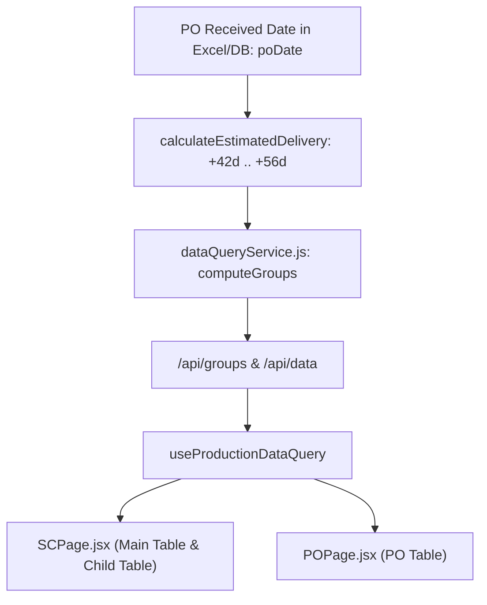

# Phase 3 — Estimated Delivery Date End-to-End Implementation
## Velan Metrology Production Dashboard

---

## 1. Executive Summary & Business Purpose

### 1.1 Purpose
This document records the design, implementation, verification, and operational guidelines for **Phase 3: Estimated Delivery Date** in the **Velan Metrology Production Dashboard**.

The Estimated Delivery Date represents the **commercial / customer-facing delivery commitment window** managed primarily by the Sales and Operations Planning teams. While shop-floor manufacturing completion for individual workpiece batches typically spans 25–45 days, customer contractual expectations and commercial lead times operate on a standard **6 to 8 week window** from the date the Purchase Order (PO) is officially received.

### 1.2 Fundamental Business Distinction
It is critical that the system strictly separates manufacturing completion dates from sales commitments:

```
┌─────────────────────────────────────────────────────────────────────────────────┐
│                               CONCEPT SEPARATION                                │
├───────────────────────────────────────┬─────────────────────────────────────────┤
│          PROJECTED DATE               │           ESTIMATED DELIVERY            │
├───────────────────────────────────────┼─────────────────────────────────────────┤
│ • Stakeholder: Manufacturing / Shop   │ • Stakeholder: Sales / Commercial / S&OP│
│ • Source: Live Excel / Google Sheet   │ • Source: Derived from PO Received Date │
│ • Entity: Product / Line Item level   │ • Entity: Commercial Delivery Window    │
│ • Meaning: Expected technical finish  │ • Meaning: Customer commitment window   │
│ • Formula: Extracted directly         │ • Formula: PO Date + 42 to 56 cal. days │
│ • Dynamics: Shifts with machining/SLA │ • Dynamics: Fixed relative to PO intake │
└───────────────────────────────────────┴─────────────────────────────────────────┘
```

> [!IMPORTANT]
> Estimated Delivery is **NEVER** calculated from Projected Date or SC Production Date (`estimatedDelivery != projectedDate + X`). The sole commercial reference point is the **PO Received Date (`poDate`)**.

---

## 2. Canonical PO Date Identification

### 2.1 Field Lineage
Across the application tiers, the canonical date on which the customer PO was received is standardized as:
- **Field Name:** `poDate`
- **Data Type:** ISO Date String (`YYYY-MM-DD`)
- **Ingestion Lineage:**
  1. `excelParser.js`: Extracted via column index (`v(4)`) or header probe (`/po\s*date|order\s*date|received\s*date/i`).
  2. `normalizeRow.js`: Normalized via `toIsoDateString(raw.poDate)`.
  3. `upload.schema.js`: Validated via Zod `rowSchema.poDate`.
  4. Database: Persisted in PostgreSQL JSONB documents (`velan_live_rows.data.poDate` and `velan_rows.data.poDate`).
  5. `dataQueryService.js`: Grouped into `poGroups[po].poDate` and `scGroups[sc].poDate`.

---

## 3. Mathematical & Calendar Calculation Rules

### 3.1 Commercial Delivery Window Definition
Unless otherwise contracted, the commercial delivery window is defined as:
$$\text{Estimated Delivery Start} = \text{PO Date} + 6\text{ calendar weeks} = \text{PO Date} + 42\text{ calendar days}$$
$$\text{Estimated Delivery End} = \text{PO Date} + 8\text{ calendar weeks} = \text{PO Date} + 56\text{ calendar days}$$

### 3.2 Calendar-Day vs Working-Day Policy
- **Calendar Days Applied:** The commercial delivery window counts contiguous calendar days without skipping Sundays, Saturdays, or statutory company holidays.
- **Independence from 21-Day SLA:** The shop-floor 21-working-day cycle time SLA is completely decoupled from this commercial window.

### 3.3 Verified Examples
- **Example 1:**
  - PO Date: `01/09/2026` (`2026-09-01`)
  - Start (+42d): `13/10/2026` (`2026-10-13`)
  - End (+56d): `27/10/2026` (`2026-10-27`)
  - Formatted Display: `13/10/2026 – 27/10/2026`
- **Example 2:**
  - PO Date: `10/09/2026` (`2026-09-10`)
  - Start (+42d): `22/10/2026` (`2026-10-22`)
  - End (+56d): `05/11/2026` (`2026-11-05`)
  - Formatted Display: `22/10/2026 – 05/11/2026`

---

## 4. Implementation Details

### 4.1 Calculation Utility (`src/utils/calculationUtils.cjs`)
```javascript
function calculateEstimatedDelivery(poDateStr, startWeeks = 6, endWeeks = 8) {
  if (!poDateStr) return null;
  const s = String(poDateStr).trim();
  if (!s || s === '—' || s === '-' || s === 'null' || s === 'undefined') return null;

  // Timezone-safe date component parsing (avoids UTC offset shifts)
  let day, month, year;
  // ... parsing ISO YYYY-MM-DD or Indian DD/MM/YYYY ...

  if (isNaN(year) || isNaN(month) || isNaN(day)) return null;
  if (year < 1900 || month < 1 || month > 12 || day < 1 || day > 31) return null;

  const addDays = (numDays) => {
    const target = new Date(year, month - 1, day + numDays);
    const ty = target.getFullYear();
    const tm = String(target.getMonth() + 1).padStart(2, '0');
    const td = String(target.getDate()).padStart(2, '0');
    return `${ty}-${tm}-${td}`;
  };

  const startDate = addDays(startWeeks * 7);
  const endDate = addDays(endWeeks * 7);

  const formatDisplay = (iso) => {
    const [y, m, d] = iso.split('-');
    return `${d}/${m}/${y}`;
  };

  return {
    startDate,
    endDate,
    formatted: `${formatDisplay(startDate)} – ${formatDisplay(endDate)}`,
  };
}
```

### 4.2 Timezone Safety Guarantee
By splitting dates into integer components (`year`, `month`, `day`) before constructing dates and extracting them locally via `getFullYear()`, `getMonth() + 1`, and `getDate()`, the calculation is impervious to midnight UTC conversion shifts.

### 4.3 Missing & Malformed Date Handling
- Inputs such as `null`, `undefined`, `""`, `"—"`, `"invalid-date"`, `"abc"` return `null`.
- The display formatter (`formatEstimatedDelivery`) returns `—` (dash), preventing crashes, `NaN`, or `01/01/1970` artifacts.

---

## 5. Data Flow & Integration



### 5.1 Backend Aggregation (`dataQueryService.js`)
In `computeGroups`:
- **`scGroups`**: Attached as `estimatedDelivery: calculateEstimatedDelivery(sg.poDate)`
- **`poGroups`**: Attached as `estimatedDelivery: calculateEstimatedDelivery(row.poDate)`

### 5.2 UI Presentation
1. **SC Page (`SCPage.jsx`):**
   - **Main SC Table:** Column `ESTIMATED DELIVERY` displays `13/10/2026 – 27/10/2026` in soft blue badge.
   - **Child Product Table:** Shows `PROJECTED DATE` (manufacturing target) and `ESTIMATED DELIVERY` (commercial window) side-by-side.
2. **PO Page (`POPage.jsx`):**
   - **PO Sets Table:** Column `ESTIMATED DELIVERY` displayed alongside PO Date, SC counts, and item status.

---

## 6. Verification & Test Coverage

### 6.1 Automated Unit Tests (`src/__tests__/utils/calculationUtils.test.js`)
The test suite covers 27 unit test cases including:
1. Exact 42-day (+6 week) and 56-day (+8 week) arithmetic.
2. Prompt Example 1 (`01/09/2026` -> `13/10/2026 – 27/10/2026`).
3. Prompt Example 2 (`10/09/2026` -> `22/10/2026 – 05/11/2026`).
4. Month rollover handling (Jan 31 -> Mar 14 to Mar 28).
5. Year rollover handling (Dec 15 -> Jan 26 to Feb 09).
6. Leap-year handling (Feb 2024 leap year vs Feb 2026 non-leap year).
7. Missing, empty, and dash date inputs returning `null`.
8. Malformed date strings returning `null`.
9. Independence from Projected Date (mutating product projected date does not affect estimated delivery).
10. `formatEstimatedDelivery` string and object formatting.

### 6.2 Test Execution Results
- **Vitest:** 33 / 33 tests passed across 3 test suites.
- **Production Build:** `vite build` completed with 0 errors.

---

## 7. Business Verification Register

| ID | Subject | Current Phase 3 Implementation | Business Verification Question |
| :--- | :--- | :--- | :--- |
| **BV-03** | Estimated Delivery Window | Fixed 6–8 calendar weeks (42–56 days) from PO Date | Should certain key customer accounts or complex product families have custom lead time windows (e.g. 10–12 weeks)? |
| **BV-04** | Calendar vs Working Days | Calendar days | Should commercial delivery deadlines count working days excluding festival shutdowns? |
| **BV-11** | Customer Contract Overrides | Derived automatically from PO Date | Should sales admins be permitted to manually override the Estimated Delivery window per PO? |

---
*Documentation generated as part of Phase 3 implementation for Velan Metrology Production Dashboard.*
