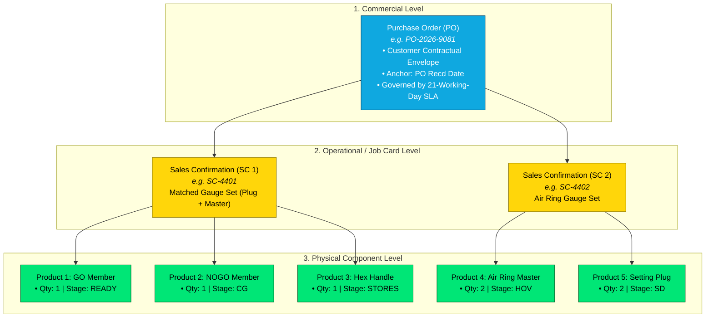
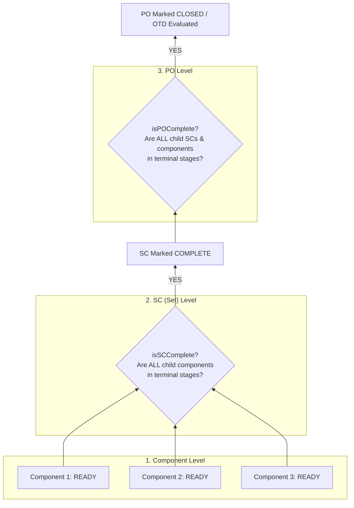
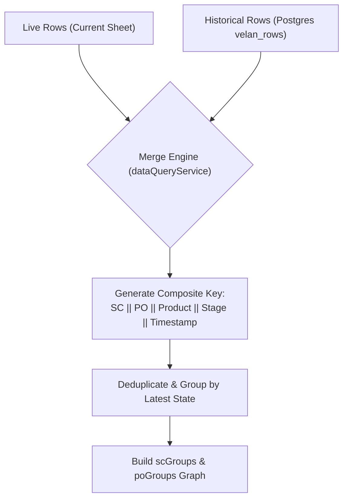

# 23 - PO, SC, and Product Commercial & Manufacturing Hierarchy

## 1. Purpose & Core Hierarchy Definition

This document explains the multi-tiered commercial and operational data hierarchy that governs the Velan Dashboard. It details how customer commercial orders (**Purchase Orders / POs**) break down into internal production job sets (**Sales Confirmations / SCs**), which in turn contain individual physical workpieces and gauge members (**Products / Components**).



---

## 2. Commercial & Operational Entity Definitions

### 2.1 Purchase Order (`PO`)
- **Business Meaning:** The formal legal and commercial purchase agreement sent by the customer.
- **Key Attributes:**
  - `po` (Alphanumeric Code, e.g., `PO-9081`, `PO-4402`).
  - `poDate` (Receipt Date at Velan Plant in ISO format `YYYY-MM-DD`).
  - `targetDate` (Customer requested due date from Column B).
- **Application Role:** 
  - Represents the primary container for plant-level **On-Time Delivery (OTD %)** calculations.
  - Anchors the 21-working-day delivery deadline countdown:
    $$\text{Target Due Date} = \text{addWorkingDays5Day}(\text{poDate}, 21)$$
  - Evaluated in `poGroups` ([`src/server/services/dataQueryService.js:computeGroups`](file:///c:/Users/Admin/OneDrive/Desktop/velan-dashboard-updated/src/server/services/dataQueryService.js#L164-L170)).

### 2.2 Sales Confirmation (`SC`)
- **Business Meaning:** The internal manufacturing job card and order acknowledgement number generated by Velan production planners.
- **Key Characteristics:**
  - **Set Container:** In metrology, precision gauges are sold as paired or matched sets (e.g., an Air Plug Gauge set includes the probe body, GO nozzle, NOGO nozzle, setting master, and handle). An SC unites these distinct physical pieces under a single inspection job card.
  - **Whitespace Normalization:** Raw SC entries are stripped of internal spaces (e.g., `"SC 4401"` $\to$ `"SC4401"`).
- **Application Role:**
  - Tracked in the `scGroups` data structure.
  - Used on the **SC Status** page to display matched set readiness.

### 2.3 Product / Component (`product`)
- **Business Meaning:** The distinct physical workpiece manufactured on the shop floor.
- **Key Attributes:**
  - `product` (Descriptive string, e.g., `APG DIA 12.000 MM GO/NOGO`, `HEX HANDLE SIZE 2`).
  - `type` (Normalized category: `APG`, `ARG`, `SPG`, `SRG`, `SP`, `ACCESSORY`).
  - `qty` (Batch quantity, defaults to 1).
  - `currentStage` (Active workstation code, e.g., `LATHE`, `CG`, `READY`).
  - `timestamp` (Timestamp when last moved or updated).

---

## 3. Multi-Level Completion Determination Rules

In a multi-tiered manufacturing hierarchy, completion is evaluated from the bottom up:



### 3.1 Component-Level Completion
A component is complete if its resolved `currentStage` belongs to the terminal set:
$$\text{isTerminal}(c) \iff c.\text{currentStage} \in \{\texttt{'READY'}, \texttt{'STORES'}, \texttt{'STOCK'}, \texttt{'EXSTOCK'}, \texttt{'DCPLI'}, \texttt{'VA'}\}$$

### 3.2 SC-Level (Set) Completion Rule
An SC represents a matched inspection tool set. A customer cannot use a GO gauge without its paired NOGO gauge or handle. Therefore:
> [!IMPORTANT]
> **Strict Set Rule:** An SC is considered complete **if and only if EVERY child component** in that SC group has reached a terminal stage. If even 1 member component remains in `CG` or `LATHE`, the entire SC is classified as **WIP (Incomplete)**.

Implemented in [`src/utils/calculationUtils.cjs:isSCComplete`](file:///c:/Users/Admin/OneDrive/Desktop/velan-dashboard-updated/src/utils/calculationUtils.cjs#L241-L243):
```javascript
function isSCComplete(items) {
  return items.every((i) => ['READY', 'STORES', 'STOCK', 'EXSTOCK', 'VA'].includes(i.currentStage));
}
```

### 3.3 PO-Level Completion & OTD Evaluation
A Purchase Order is complete when **all child items across all SCs** are terminal:
1. **Total Duration Calculation:**
   $$\text{Actual Working Days} = \text{workingDaysBetween}(\text{poDate}, \max(\text{items.timestamp}))$$
2. **On-Time vs. Delayed Evaluation:**
   - If $\text{Actual Working Days} \le 21\text{ working days} \implies \mathbf{On\text{-}Time}$
   - If $\text{Actual Working Days} > 21\text{ working days} \implies \mathbf{Delayed}$
3. **In-Progress Delay Rule:** If an open PO's elapsed working days from `poDate` to `todayStr` exceeds 21 days, it is flagged as **Delayed In-Progress** ([`src/server/services/kpiService.js:calculateKPIs`](file:///c:/Users/Admin/OneDrive/Desktop/velan-dashboard-updated/src/server/services/kpiService.js#L112-L117)).

---

## 4. Backend Hierarchy Data Structures

The server service [`src/server/services/dataQueryService.js`](file:///c:/Users/Admin/OneDrive/Desktop/velan-dashboard-updated/src/server/services/dataQueryService.js) constructs optimized object graphs for both levels:

### 4.1 `scGroups` Graph Schema
```typescript
interface SCGroup {
  sc: string;             // e.g. "SC-4401"
  po: string;             // e.g. "PO-2026-9081"
  poDate: string;         // "YYYY-MM-DD"
  items: Array<{
    sno?: string | number;
    po: string;
    poDate: string;
    sc: string;
    product: string;
    type: "APG" | "ARG" | "SPG" | "SRG" | "SP" | "ACCESSORY";
    qty: number;
    currentStage: string;
    inhouse: "INHOUSE" | "VENDOR";
    timestamp: string;
    _isLive?: boolean;
  }>;
}
```

### 4.2 `poGroups` Graph Schema
```typescript
interface POGroup {
  po: string;             // e.g. "PO-2026-9081"
  poDate: string;         // "YYYY-MM-DD"
  items: Array<RowItem>;  // All constituent component rows across all child SCs
}
```

---

## 5. Truncated Product Name Resolution Logic

In Google Sheets or Excel exports, long product descriptions are frequently truncated with trailing ellipsis (e.g., `"APG DIA 12.000 MM GO/NOGO ..."`). If not resolved, child components fail grouping and duplicate false product entries appear.

### 5.1 Resolution Algorithm
The helper function `normalizeProductsInGroup` in [`src/utils/calculationUtils.cjs`](file:///c:/Users/Admin/OneDrive/Desktop/velan-dashboard-updated/src/utils/calculationUtils.cjs#L254-L270) matches truncated strings against full descriptions within the same SC group:
1. Collect all complete (non-truncated) product names in the group:
   $$\text{fullNames} = \{p \in \text{group.products} \mid \neg p.\text{endsWith}(\texttt{'...'})\}$$
2. For each row where `product` ends with `'...'`:
   - Extract string prefix: $\text{prefix} = \text{product}.\text{slice}(0, -3)$.
   - Match against `fullNames`: find first $f \in \text{fullNames}$ where $f.\text{startsWith}(\text{prefix})$.
   - If matched, replace truncated name with full description $f$.

---

## 6. Deduplication & Multi-Row Progression

When operators enter updates into tracking sheets, history rows and live status rows are merged into the consolidated pipeline:



### 6.1 State Selection Precedence
Within an SC group, when duplicate rows for the same `(sc, product)` pair exist across live and historical datasets:
1. **Live Precedence:** If row $A$ is from `velan_live_rows` (`_isLive: true`) and row $B$ is from `velan_rows` (`_isLive: false`), row $A$ takes precedence.
2. **Timestamp Precedence:** If both rows share the same live/history origin, the row with the newer `timestamp` is selected.

---

## 7. Aggregation Formulas Reference

| Hierarchy Level | Metric Name | Mathematical Formula | Purpose |
| :--- | :--- | :--- | :--- |
| **Component** | Stage Aging | $\text{workingDaysBetween}(\text{timestamp}, \text{todayStr})$ | Identifies machine-level queue delays. |
| **Component** | Component Cycle Time | $\text{workingDaysBetween}(\text{poDate}, \text{timestamp})$ | Measures elapsed time since plant receipt. |
| **SC Set** | SC Completion % | $\frac{|\{c \in \text{SC.items} \mid \text{isTerminal}(c)\}|}{|\text{SC.items}|} \times 100$ | Partial set progress bar on SC page. |
| **SC Set** | SC Last Activity | $\max_{c \in \text{SC.items}}(c.\text{timestamp})$ | Determines date of set completion. |
| **PO Contract** | PO Total Quantity | $\sum_{i \in \text{PO.items}} i.\text{qty}$ | Total physical gauge volume in PO. |
| **PO Contract** | PO Completion % | $\frac{|\{i \in \text{PO.items} \mid \text{isTerminal}(i)\}|}{|\text{PO.items}|} \times 100$ | Executive order progress indicator. |
| **PO Contract** | PO Working Cycle Time| $\text{workingDaysBetween}(\text{poDate}, \max(i.\text{timestamp}))$ | Used for official OTD % evaluation. |

---

## 8. Edge Cases & Special Scenarios

1. **Merged Cell Blank POs:** When child rows under an SC omit the `PO NO` header due to visual spreadsheet merging, `excelParser.js` propagates `currentPO` downward automatically.
2. **Orphan Products (SC without PO):** If a row has an SC number but no PO, the system isolates it into an `UNKNOWN_PO` bucket, preventing calculation crashes.
3. **Split Batch Quantities:** When a single line item with $\text{QTY} > 1$ is partially finished (e.g. 5 ready, 5 in grinding), shop-floor sheets often create 2 separate rows sharing the same SC and Product description with differing stages. The grouping engine preserves both line instances.

---

## 9. Related Documentation & Cross References

- [21 - Excel / Google Sheet Data Dictionary](file:///c:/Users/Admin/OneDrive/Desktop/velan-dashboard-updated/docs/21-velan-excel-data-dictionary.md) - Field specifications for `po`, `sc`, and `product`.
- [22 - Production Workflow](file:///c:/Users/Admin/OneDrive/Desktop/velan-dashboard-updated/docs/22-production-workflow.md) - Workstation progression and stage aging.
- [24 - Status & Operation Mapping Dictionary](file:///c:/Users/Admin/OneDrive/Desktop/velan-dashboard-updated/docs/24-status-operation-mapping.md) - Regex stage extraction.
- [25 - Dashboard Metric Data Lineage](file:///c:/Users/Admin/OneDrive/Desktop/velan-dashboard-updated/docs/25-dashboard-metric-data-lineage.md) - Step-by-step trace to KPI cards.
- [26 - Real-World Business Rules](file:///c:/Users/Admin/OneDrive/Desktop/velan-dashboard-updated/docs/26-real-world-business-rules.md) - Comprehensive catalog of business rules.
