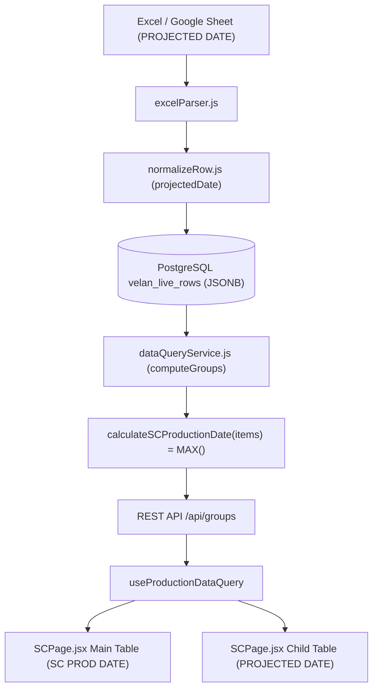

# Phase 4 — SC Production Date Implementation
## Velan Metrology Production Dashboard

---

## 1. Executive Summary & Purpose

### 1.1 Purpose
This document records the design, implementation, verification, and operational guidelines for **Phase 4: SC Production Date** in the **Velan Metrology Production Dashboard**.

A Sales Confirmation (SC / Set) represents a multi-item production order containing one or more distinct metrology products (gauges, masters, air plugs, accessories). Because an SC cannot be released, packaged, or shipped until its final physical component completes all production operations, the **SC Production Date** represents the **latest projected manufacturing completion date** among all constituent workpieces in that SC.

### 1.2 Mathematical Definition
For each SC / Set:
$$\text{SC Production Date} = \max_{p \in \text{SC, valid}} (\text{Projected Date}_p)$$

Where:
- $\text{Projected Date}_p$ is the product-level expected completion date ingested from the source Excel/Google Sheet (Phase 2).
- Only valid ISO date strings (`YYYY-MM-DD` or parsed `DD/MM/YYYY`) participate in the maximum calculation.
- Missing, blank (`—`), and malformed dates are discarded without corrupting the SC calculation.

---

## 2. Concept Separation & Business Rule Hierarchy

```
┌─────────────────────────────────────────────────────────────────────────────────────────────┐
│                                 THREE-TIER DATE ARCHITECTURE                                │
├──────────────────────────┬─────────────────────────────┬────────────────────────────────────┤
│   PRODUCT PROJECTED DATE │      SC PRODUCTION DATE     │         ESTIMATED DELIVERY         │
├──────────────────────────┼─────────────────────────────┼────────────────────────────────────┤
│ • Level: Product Item    │ • Level: Sales Confirmation │ • Level: Commercial Order (PO)     │
│ • Source: Live Sheet row │ • Source: Derived dynamically│ • Source: Derived from PO Date    │
│ • Scope: Individual item │ • Scope: Max of SC products │ • Scope: Customer 6-8 week window  │
│ • Audience: Machine shop │ • Audience: Assembly & S&OP │ • Audience: Sales & Customers      │
│ • Formula: Extracted     │ • Formula: MAX(child dates) │ • Formula: PO Date + 42d .. 56d    │
└──────────────────────────┴─────────────────────────────┴────────────────────────────────────┘
```

> [!IMPORTANT]
> **Strict Independence Rules:**
> 1. `SC Production Date` is **NEVER** calculated from `Estimated Delivery` or `PO Date`.
> 2. `Estimated Delivery` is **NEVER** calculated from `Projected Date` or `SC Production Date`.
> 3. Modifying `poDate` changes `Estimated Delivery` but leaves `SC Production Date` unaffected.
> 4. Modifying product `projectedDate` dynamically updates `SC Production Date` but leaves `Estimated Delivery` unaffected.

---

## 3. Calculation Utility Implementation

### 3.1 Implementation (`src/utils/calculationUtils.cjs`)
```javascript
function calculateSCProductionDate(items) {
  if (!items || !Array.isArray(items) || items.length === 0) return null;
  const validIsoDates = [];
  for (const item of items) {
    if (!item) continue;
    const rawVal = item.projectedDate || item.projected_date;
    if (!rawVal) continue;
    const s = String(rawVal).trim();
    if (!s || s === '—' || s === '-' || s === 'null' || s === 'undefined') continue;

    // 1. Direct ISO YYYY-MM-DD
    if (/^\d{4}-\d{2}-\d{2}$/.test(s)) {
      const parts = s.split('-');
      const y = parseInt(parts[0], 10);
      const m = parseInt(parts[1], 10);
      const d = parseInt(parts[2], 10);
      if (y >= 1900 && m >= 1 && m <= 12 && d >= 1 && d <= 31) {
        validIsoDates.push(s);
        continue;
      }
    }

    // 2. Parse DD/MM/YYYY or DD-MM-YYYY fallback
    // ... converts Indian/UK format to YYYY-MM-DD ...
    if (year >= 1900 && month >= 1 && month <= 12 && day >= 1 && day <= 31) {
      const iso = `${year}-${String(month).padStart(2, '0')}-${String(day).padStart(2, '0')}`;
      validIsoDates.push(iso);
    }
  }

  if (validIsoDates.length === 0) return null;
  validIsoDates.sort(); // Lexicographical ISO string sorting matches chronological order
  return validIsoDates[validIsoDates.length - 1];
}
```

---

## 4. Behavior & Edge Case Scenarios

| Scenario | Input Child Products | Resulting `scProductionDate` | Display on UI | Notes |
| :--- | :--- | :--- | :--- | :--- |
| **All Valid** | `15/09/2026`, `14/09/2026`, `20/09/2026` | `2026-09-20` | `20/09/2026` | Standard SC 1571 example |
| **Single Product** | `15/09/2026` | `2026-09-15` | `15/09/2026` | Single-item SC |
| **Mixed Dates** | `15/09/2026`, `null`, `20/09/2026` | `2026-09-20` | `20/09/2026` | Missing entries safely ignored |
| **Invalid Dates** | `invalid`, `15/09/2026`, `20/09/2026` | `2026-09-20` | `20/09/2026` | Malformed strings discarded |
| **All Missing** | `null`, `""`, `"—"`, `undefined` | `null` | `—` | Graceful fallback |
| **Empty SC** | `[]` | `null` | `—` | No items in SC |

---

## 5. Live Dynamic Update Behavior

Because `scProductionDate` is derived dynamically during group aggregation in `dataQueryService.js` and React memoization in `SCPage.jsx`:
- **Initial state (SC 1571):**
  - Product A: `15/09/2026`
  - Product B: `14/09/2026`
  - Product C: `20/09/2026`
  - $\to \text{SC PROD DATE} = \text{20/09/2026}$
- **Update 1 (Product B delayed):**
  - Product B changed in sheet to `30/09/2026`
  - $\to \text{SC PROD DATE}$ automatically updates to $\text{30/09/2026}$.
- **Update 2 (Product B rescheduled earlier):**
  - Product B changed in sheet to `10/09/2026`
  - $\to \text{SC PROD DATE}$ automatically returns to $\text{20/09/2026}$ (driven by Product C).
- **Update 3 (All dates cleared):**
  - Products A, B, C dates removed
  - $\to \text{SC PROD DATE}$ renders $\text{—}$.

---

## 6. Architecture & Data Flow



---

## 7. Automated Test Validation

Unit tests in `src/__tests__/utils/calculationUtils.test.js`:
- **Test 1 — Empty array:** `calculateSCProductionDate([])` $\to$ `null`
- **Test 2 — All missing dates:** `[null, null, '—']` $\to$ `null`
- **Test 3 — Single valid date:** `['2026-09-15']` $\to$ `'2026-09-15'`
- **Test 4 — SC 1571 example:** `['2026-09-15', '2026-09-14', '2026-09-20']` $\to$ `'2026-09-20'`
- **Test 5 — Mixed missing values:** `['2026-09-15', null, '2026-09-20']` $\to$ `'2026-09-20'`
- **Test 6 — Invalid date strings:** `['invalid', '2026-09-15', '2026-09-20']` $\to$ `'2026-09-20'`
- **Test 7 — SC isolation:** SC 1571 (`20/09/2026`) and SC 1572 (`12/09/2026`) remain isolated.
- **Test 8 — Dynamic date changes:** `15,14,20 -> 20` $\to$ `15,30,20 -> 30` $\to$ `15,10,20 -> 20`.
- **Test 9 & 10 — Concept independence:** Mutating `poDate` alters `Estimated Delivery` but does not alter `SC Production Date`; mutating `projectedDate` alters `SC Production Date` but does not alter `Estimated Delivery`.
- **Test 11 — DD/MM/YYYY formatting:** Slashed input dates safely converted and compared.

### Test Results
- **Vitest Runner:** 44 / 44 tests passing across all suites.
- **Vite Build:** 0 compilation errors.

---
*Documentation generated as part of Phase 4 implementation for Velan Metrology Production Dashboard.*
