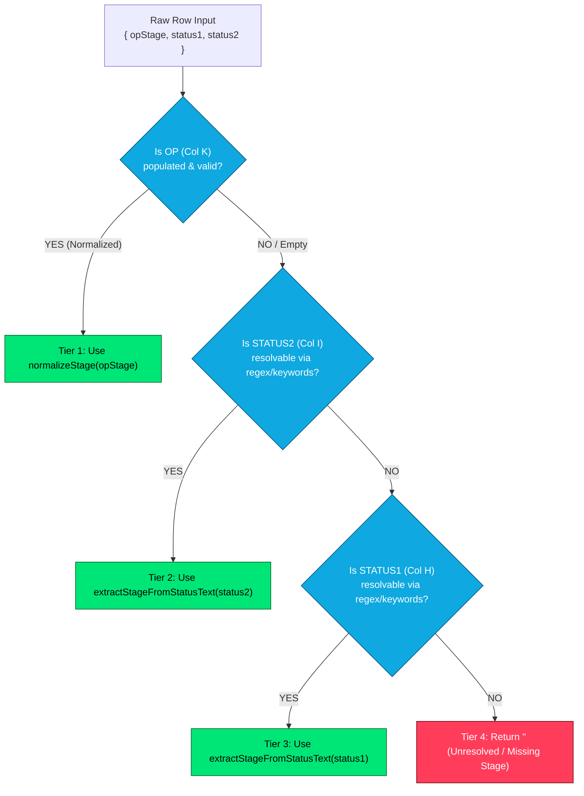
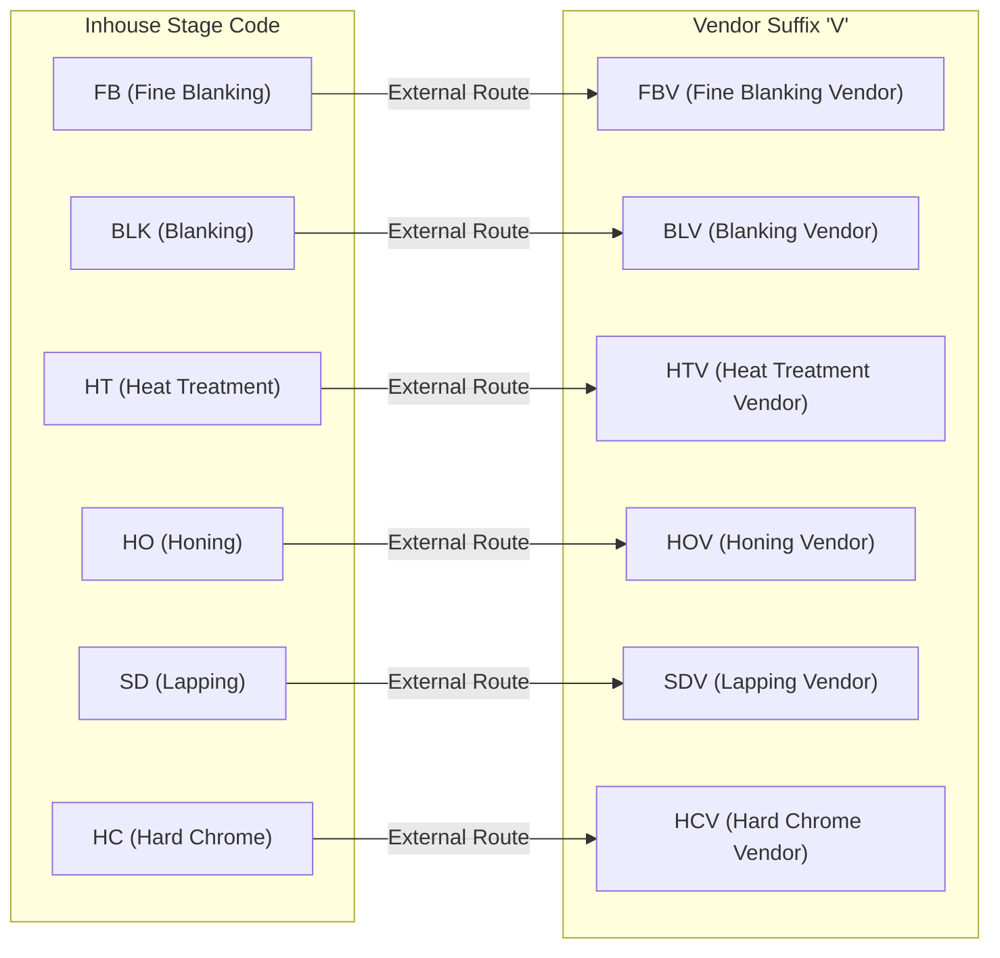

# 24 - Status & Operation Stage Mapping & Resolution Dictionary

## 1. Purpose & Core Mapping Philosophy

On the Velan Metrology shop floor, workstation updates are logged by operators with varying levels of formatting discipline. Notes are entered across three distinct spreadsheet columns: Column K (`OP`), Column H (`STATUS1`), and Column I (`STATUS2`). 

This document defines the 3-tier cascade resolution algorithm, regex extraction patterns, typo correction dictionaries, vendor suffix conventions, and the exhaustive mapping matrix that transforms raw operator strings into normalized operational stages.

---

## 2. The 3-Tier Stage Resolution Cascade

The core resolution engine in [`src/services/stageResolver.js`](file:///c:/Users/Admin/OneDrive/Desktop/velan-dashboard-updated/src/services/stageResolver.js) processes row entries using a strict precedence waterfall:



### 2.1 Code Implementation ([`src/services/stageResolver.js:resolveLatestStage`](file:///c:/Users/Admin/OneDrive/Desktop/velan-dashboard-updated/src/services/stageResolver.js#L47-L54))
```javascript
function resolveLatestStage({ opStage, status1, status2 }) {
  // OP column is primary — use it if it resolves to a known stage
  const fromOp = normalizeStage(opStage);
  if (fromOp) return fromOp;

  // OP column empty/unresolved — fall back to free-text status fields
  return extractStageFromStatusText(status2) || extractStageFromStatusText(status1) || '';
}
```

---

## 3. Regex Pattern & Text Extraction Engine

When Column K (`OP`) is blank, the engine analyzes free-text operational notes using `extractStageFromStatusText(text)`:

### 3.1 Pattern 1: Movement Directive Regex
Operators frequently enter transfer instructions such as `"MOVE TO CG"`, `"MOVE TO HTV"`, or `"MOVETO M1"`.
- **Regex:** `/MOVE\s*TO\s*([A-Z0-9]+)/i`
- **Capture:** Captures the target workstation token and passes it to `normalizeStage()`.

### 3.2 Pattern 2: Word Boundary Keyword Checks
If no movement directive is found, the parser checks for explicit commercial terminal tokens:
- `/\bSTOCK\b/` $\implies \texttt{'STOCK'}$
- `/\bSTORES?\b/` $\implies \texttt{'STORES'}$
- `/\bREADY\b/` $\implies \texttt{'READY'}$

### 3.3 Pattern 3: Known Stages Substring Scan
If no keyword matches, the string is scanned against the canonical stage token list:
```javascript
const knownStages = [
  'LATHE', 'M1', 'FB', 'HT', 'SZ', 'BLK', 'CG', 'SG', 'SD', 
  'HO', 'CA', 'WC', 'VA', 'QC', 'DCPLI', 'FBV', 'BLV', 'SDV', 
  'HOV', 'HTV', 'HCV', 'RM'
];
```

---

## 4. Typo Correction & Alias Dictionaries

The normalization layer in [`src/services/dataNormalizer.js`](file:///c:/Users/Admin/OneDrive/Desktop/velan-dashboard-updated/src/services/dataNormalizer.js) catches common shop-floor spelling variations and whitespace anomalies.

### 4.1 Alias Map (`normalizeStage`)
Before matching, periods and spaces are stripped, and the string is converted to uppercase.

| Raw Variation | Corrected Canonical Token | Business Process |
| :--- | :--- | :--- |
| `STORE`, `STORRES`, `STOERS` | `STORES` | In-Plant Finished Goods Store |
| `READDY`, `REAADY` | `READY` | Inspection Passed / Certified |
| `STOCKK` | `STOCK` | Buffer Commercial Inventory |
| `DCPL` | `DCPLI` | Dispatched with Delivery Challan |
| `HOVE` | `HOV` | Honing Subcontract Vendor |
| `BLACKENEING`, `BLACKNING`, `BLACKENNING` | `BLACKENING` | Surface Chemical Oxide Treatment |

### 4.2 Operation Spelling Dictionary (`STAGE_CORRECTIONS`)
```javascript
const STAGE_CORRECTIONS = {
  BLACKENEING: 'BLACKENING',
  BLACKNING: 'BLACKENING',
  BLACKENNING: 'BLACKENING',
  BLACING: 'PLACING',
  BRASING: 'BRAZING',
  'PLATING ': 'PLATING',
  READDY: 'READY',
  REAADY: 'READY',
  STORE: 'STORES',
  STORRES: 'STORES',
  STOERS: 'STORES',
  CALIBARTION: 'CALIBRATION',
  CALLIBRATION: 'CALIBRATION',
};
```

---

## 5. Vendor Suffix Convention (`'V'`)

Subcontracted vendor stages follow a standard trailing `'V'` notation:



- **Vendor Rule:** Any stage ending in `'V'` (e.g., `HTV`, `SDV`) automatically infers `inhouse = 'VENDOR'`.
- **Aging Rule:** All vendor stages operate under the strict **2-working-day SLA limit**.

---

## 6. Product Type Inference & Category Hierarchy

The system automatically infers product families and categories from raw component descriptions in Column F (`Product Name`).

### 6.1 Product Type Inference (`inferType` in `dataNormalizer.js`)
```javascript
function inferType(productName) {
  if (!productName) return 'ACCESSORY';
  const p = String(productName).toUpperCase().trim();
  if (p.startsWith('APG') || p.startsWith('2 PAIR APG')) return 'APG';
  if (p.startsWith('ARG')) return 'ARG';
  if (p.startsWith('SRG')) return 'SRG';
  if (p.startsWith('SP ') || p.startsWith('SP\t') || p === 'SP' || /^SP DIA/.test(p)) return 'SP';
  if (p.startsWith('SPG')) return 'SPG';
  return 'ACCESSORY';
}
```

### 6.2 Product Category Grouping (`getProductCategory` in `calculationUtils.cjs`)
```javascript
const AIRPLUG_TYPES = ['APG', 'ARG'];
const MASTER_TYPES = ['SPG', 'SRG', 'SP'];

function getProductCategory(type) {
  if (AIRPLUG_TYPES.includes(type)) return 'AIRPLUG';
  if (MASTER_TYPES.includes(type)) return 'MASTER';
  return 'ACCESSORY';
}
```

---

## 7. Exhaustive Stage Mapping Matrix

| Raw Input Variations (OP / Status) | Normalized Stage | Category | Default Location | Terminal Stage? | UI Badge Color | Description & Business Process |
| :--- | :--- | :--- | :--- | :---: | :---: | :--- |
| `RM`, `RAW MATERIAL`, `CUTTING` | `RM` | Raw Material | Inhouse | No | `#7ba7cc` | Raw bar cutting & billet preparation |
| `FB`, `FINE BLANKING`, `STAMPING` | `FB` | Raw Material | Inhouse | No | `#ffd60a` | Inhouse blank stamping |
| `FBV`, `FB VENDOR`, `MOVE TO FBV` | `FBV` | Raw Material | **VENDOR** | No | `#b24bff` | Subcontract fine blank stamping |
| `BLK`, `BLANK`, `BLANK PREP` | `BLK` | Raw Material | Inhouse | No | `#7ba7cc` | Blank turning and dimensioning |
| `BLV`, `BLANK VENDOR`, `MOVE TO BLV`| `BLV` | Raw Material | **VENDOR** | No | `#b24bff` | Subcontract blank preparation |
| `LATHE`, `TURNING`, `LATH`, `CNC` | `LATHE` | Machining | Inhouse | No | `#ff3d5a` | Primary OD turning, facing, threading |
| `M1`, `MILLING`, `VMC`, `M/C` | `M1` | Machining | Inhouse | No | `#ff3d5a` | Vertical machining & nozzle slotting |
| `HT`, `HEAT TREATMENT`, `HARDENING` | `HT` | Thermal | Inhouse | No | `#ff6b35` | Inhouse hardening & tempering |
| `HTV`, `HT VENDOR`, `MOVE TO HTV` | `HTV` | Thermal | **VENDOR** | No | `#b24bff` | External vacuum heat treatment |
| `BLACKENING`, `BLACKNING`, `OXIDE` | `BLACKENING` | Thermal | Inhouse | No | `#7ba7cc` | Black oxide corrosion treatment |
| `SZ`, `SIZING`, `POST HT SIZING` | `SZ` | Precision Mach | Inhouse | No | `#7ba7cc` | Post-hardening dimensional trueing |
| `CG`, `CYLIND GRIND`, `OD GRIND` | `CG` | Precision Mach | Inhouse | No | `#ffd60a` | Precision cylindrical OD grinding |
| `SG`, `SURF GRIND`, `FLAT GRIND` | `SG` | Precision Mach | Inhouse | No | `#0fa8e0` | Precision flat surface grinding |
| `HO`, `HONING`, `ID HONING` | `HO` | Precision Mach | Inhouse | No | `#7ba7cc` | Internal precision cylinder honing |
| `HOV`, `HOVE`, `HONING VENDOR` | `HOV` | Precision Mach | **VENDOR** | No | `#b24bff` | Subcontract deep bore honing |
| `SD`, `LAPPING`, `SUPER FINISH` | `SD` | Finishing | Inhouse | No | `#7ba7cc` | Diamond paste mirror micro-lapping |
| `SDV`, `LAPPING VENDOR` | `SDV` | Finishing | **VENDOR** | No | `#b24bff` | Subcontract diamond micro-lapping |
| `WC`, `WIRE CUT`, `EDM` | `WC` | Precision Mach | Inhouse | No | `#7ba7cc` | Wire electrical discharge machining |
| `HCV`, `HARD CHROME`, `PLATING` | `HCV` | Finishing | **VENDOR** | No | `#b24bff` | Hard chrome surface plating vendor |
| `CA`, `CALIB ASSY`, `ASSEMBLY` | `CA` | Assembly | Inhouse | No | `#7ba7cc` | Gauge member & handle assembly |
| `VA`, `VALUE ADD`, `LASER MARK` | `VA` | Quality / Prep | Inhouse | Yes* | `#ff6b35` | Laser etching & cosmetic finishing |
| `QC`, `INSPECTION`, `CALIBRATION` | `QC` | Quality | Inhouse | No | `#b24bff` | Metrology lab calibration inspection |
| `READY`, `READDY`, `REAADY`, `PACKED`| `READY` | Terminal | Inhouse | **YES** | `#00e676` | Calibration approved & packed |
| `STORES`, `STORE`, `STORRES`, `STOERS`| `STORES` | Terminal | Inhouse | **YES** | `#00c9ff` | In-plant bonded finished goods store |
| `STOCK`, `STOCKK`, `EXSTOCK` | `STOCK` | Terminal | Inhouse | **YES** | `#00c9ff` | Commercial buffer catalogue stock |
| `DCPLI`, `DCPL`, `DISPATCHED` | `DCPLI` | Terminal | External | **YES** | `#00e676` | Delivered / Invoiced at customer |

*\*Note: `VA` is treated as terminal in `isSCComplete` set calculations.*

---

## 8. UI Stage Color Mapping Palette

The frontend visual color coding is governed by `getStageColor(stage)` in [`src/services/dataNormalizer.js`](file:///c:/Users/Admin/OneDrive/Desktop/velan-dashboard-updated/src/services/dataNormalizer.js#L77-L94):

| Stage Pattern | Color Hex Code | Swatch | Visual Purpose |
| :--- | :---: | :---: | :--- |
| `READY` | `#00e676` | 🟢 | Bright Neon Green (Approved & Complete) |
| `STORES`, `STOCK` | `#00c9ff` | 🔵 | Bright Cyan Blue (In Storage Inventory) |
| `LATHE`, `M1` | `#ff3d5a` | 🔴 | Bright Crimson Red (Active High-Load Machining) |
| `HT`, `VA` | `#ff6b35` | 🟠 | Vivid Orange (Thermal & Value Addition) |
| `CG`, `FB` | `#ffd60a` | 🟡 | Bright Amber Yellow (Precision Grinding & Blanking) |
| `SG` | `#0fa8e0` | 🔷 | Steel Blue (Surface Grinding) |
| `QC`, `*V` (Vendors) | `#b24bff` | 🟣 | Electric Violet (Quality Lab & Subcontractors) |
| Fallback / Other | `#7ba7cc` | 🔘 | Muted Slate Blue (Standard Workstations) |

---

## 9. Related Documentation & Cross References

- [21 - Excel / Google Sheet Data Dictionary](file:///c:/Users/Admin/OneDrive/Desktop/velan-dashboard-updated/docs/21-velan-excel-data-dictionary.md) - Spreadsheet input fields.
- [22 - Production Workflow](file:///c:/Users/Admin/OneDrive/Desktop/velan-dashboard-updated/docs/22-production-workflow.md) - Workstation lifecycle and aging.
- [23 - PO, SC, and Product Hierarchy](file:///c:/Users/Admin/OneDrive/Desktop/velan-dashboard-updated/docs/23-po-sc-product-hierarchy.md) - Groupings and completion sets.
- [25 - Dashboard Metric Data Lineage](file:///c:/Users/Admin/OneDrive/Desktop/velan-dashboard-updated/docs/25-dashboard-metric-data-lineage.md) - Stage metric propagation to UI.
- [26 - Real-World Business Rules](file:///c:/Users/Admin/OneDrive/Desktop/velan-dashboard-updated/docs/26-real-world-business-rules.md) - Canonical operational rules.
