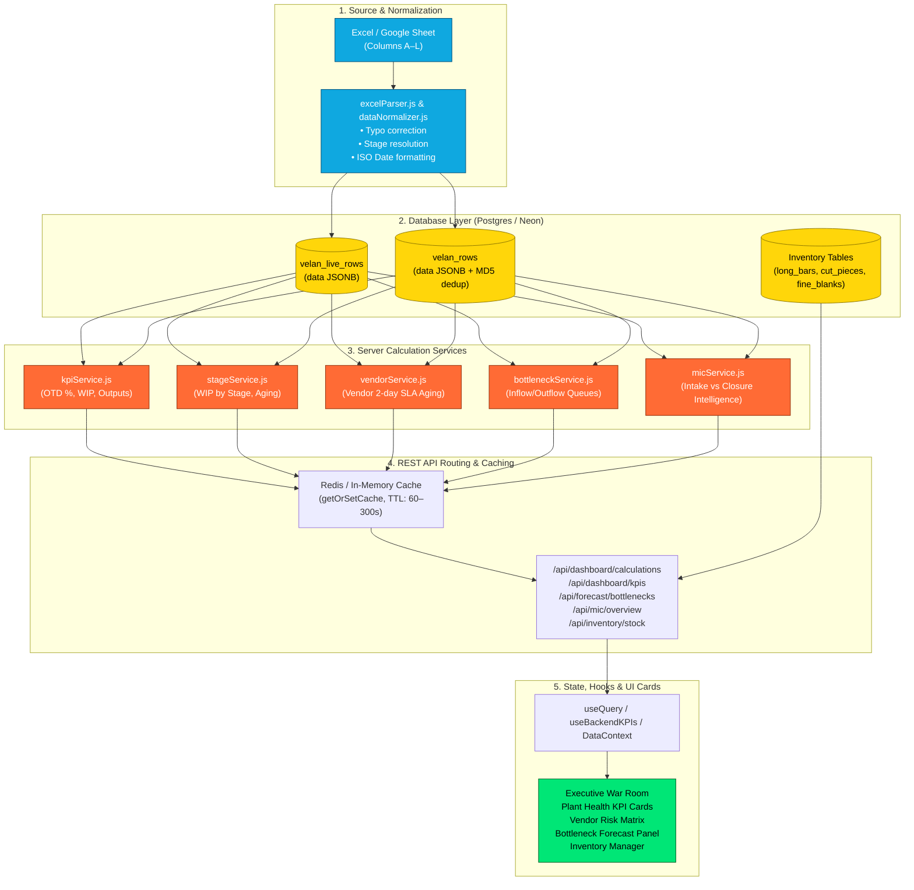
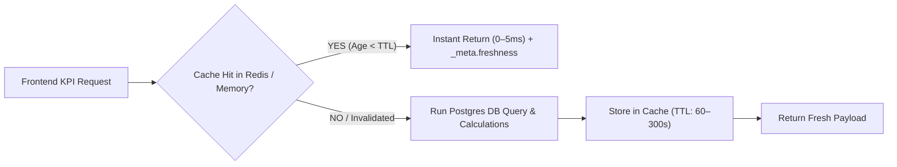

# 25 - Dashboard Metric Data Lineage & End-to-End Traceability Matrix

## 1. Purpose & Architecture Overview

This document provides the end-to-end data lineage for every key performance indicator (KPI), operational chart, bottleneck alert, and inventory metric displayed across the **Velan Dashboard**. It traces data transformations step-by-step from raw spreadsheet cells to final UI render trees.

---

## 2. Data Lineage Flow Architecture

---

## 3. Master Lineage Traceability Matrix

| Metric Name | Source Excel Column(s) | Normalized Field(s) | DB Path (`velan_rows`) | Calculation Logic / Function | REST Endpoint & JSON Path | Frontend Hook / Context | Target UI Component & Page |
| :--- | :--- | :--- | :--- | :--- | :--- | :--- | :--- |
| **On-Time Delivery (OTD %)** | Col D (`PO RECD DATE`), Col L (`OP UPDATED DATE`), Col K (`OP`) | `poDate`, `timestamp`, `currentStage` | `data->>'poDate'`, `data->>'timestamp'`, `data->>'currentStage'` | $\frac{\text{onTimePOs}}{\text{completedPOCount}} \times 100$ `kpiService.js:calculateKPIs` | `GET /api/dashboard/kpis` `res.onTimePct` | `useBackendKPIs` `kpis.onTimePct` | `<KPICard title="On-Time Delivery"/>` `Executive.jsx`, `Dashboard.jsx` |
| **Total Plant WIP** | Col K (`OP`), Col H (`STATUS1`), Col I (`STATUS2`) | `currentStage` | `data->>'currentStage'` | Count of rows where `currentStage` $\notin \text{Terminal Set}$ `kpiService.js` | `GET /api/dashboard/kpis` `res.wip` | `useBackendKPIs` `kpis.wip` | `<KPICard title="Total WIP"/>` `Dashboard.jsx`, `ProductionMetrics.jsx` |
| **WIP by Stage** | Col K (`OP`) | `currentStage` | `data->>'currentStage'` | Aggregated count per stage key `stageService.js:calculateStages` | `GET /api/dashboard/stages` `res.stageWIP` | `useBackendKPIs` `kpis.stageWIP` | `<StageDistributionChart/>` `ProductionMetrics.jsx` |
| **Vendor SLA Violations (>2 Days)** | Col J (`INHOUSE/VENDOR`), Col K (`OP`), Col L (`TIMESTAMP`) | `inhouse`, `currentStage`, `timestamp` | `data->>'inhouse'`, `data->>'currentStage'`, `data->>'timestamp'` | `workingDaysBetween(timestamp, todayStr) > 2` `vendorService.js:calculateVendors` | `GET /api/dashboard/vendors` `res.vendorDelayedCount` | `useBackendKPIs` `kpis.vendorDelayedCount` | `<VendorBottleneckAlert/>` `VendorPage.jsx`, `Dashboard.jsx` |
| **Bottleneck Stage Identification** | Col K (`OP`), Col L (`TIMESTAMP`) | `currentStage`, `timestamp` | `data->>'currentStage'`, `data->>'timestamp'` | Current queue size + Inflow/Outflow velocity differential `bottleneckDetection.js` | `GET /api/forecast/bottlenecks` `res.currentBottleneck` | `useForecastQuery` `forecast.currentBottleneck` | `<BottleneckForecast/>` `ForecastingPage.jsx` |
| **Monthly Intake & Closure (MIC)** | Col D (`PO RECD DATE`), Col L (`TIMESTAMP`), Col K (`OP`) | `poDate`, `timestamp`, `currentStage` | `data->>'poDate'`, `data->>'timestamp'`, `data->>'currentStage'` | 30d/60d historical intake vs terminal completions `micService.js:calculateMIC` | `GET /api/mic/overview` `res.intakeVsClosure` | `useMICQuery` `mic.intakeVsClosure` | `<MICDashboard/>` `MICPage.jsx` |
| **SC (Set) Completion Count** | Col E (`SC`), Col K (`OP`) | `sc`, `currentStage` | `data->>'sc'`, `data->>'currentStage'` | `isSCComplete(sc.items)` ($\forall item \in \text{Terminal}$) `kpiService.js` | `GET /api/dashboard/kpis` `res.completeSets` | `useBackendKPIs` `kpis.completeSets` | `<SCStatusTable/>` `SCStatusPage.jsx` |
| **PO Cycle Time (Days)** | Col D (`PO RECD DATE`), Col L (`TIMESTAMP`) | `poDate`, `timestamp` | `data->>'poDate'`, `data->>'timestamp'` | $\text{workingDaysBetween}(\text{poDate}, \max(\text{timestamp}))$ `cycleTimeService.js` | `GET /api/dashboard/cycle-times` `res.avgPOCycleTime` | `useBackendKPIs` `kpis.avgPOCycleTime` | `<CycleTimeCard/>` `Executive.jsx` |
| **Cut Piece Raw Inventory** | Cut piece logs | `cutDimension`, `quantityAvailable` | `cut_piece_inventory.quantity_available` | Atomic sum of available billets post-sawing `inventory.js:GET /stock` | `GET /api/inventory/stock` `res[].quantityAvailable` | `useInventoryQuery` | `<CutPieceTable/>` `InventoryPage.jsx` |
| **Fine Blank Stock** | Stamping logs | `fineBlankName`, `quantityAvailable` | `fine_blank_inventory.quantity_available` | Atomic inventory balance post-hydraulic press `inventory.js:GET /fine-blank-stock` | `GET /api/inventory/fine-blank-stock` `res[].quantityAvailable` | `useInventoryQuery` | `<FineBlankStockPanel/>` `InventoryPage.jsx` |

---

## 4. Deep-Dive Lineage Traces

### 4.1 On-Time Delivery (OTD %) Lineage
1. **Source Extraction:** `excelParser.js` ingests Column D (`PO RECD DATE`) and Column L (`OP UPDATED DATE`).
2. **Normalization:** `dataNormalizer.js` converts dates to ISO format (`YYYY-MM-DD`).
3. **Database Retrieval:** `dataQueryService.js:computeGroups` groups rows into `poGroups`.
4. **Business Calculation ([`src/server/services/kpiService.js`](file:///c:/Users/Admin/OneDrive/Desktop/velan-dashboard-updated/src/server/services/kpiService.js#L97-L120)):
   - Checks if every component in `pg.items` has a stage in `['READY', 'STORES', 'STOCK', 'EXSTOCK', 'VA']`.
   - If complete: $\text{days} = \text{workingDaysBetween}(\text{poDate}, \max(\text{items.timestamp}))$.
   - If $\text{days} \le 21$, increment `onTime`. Otherwise increment `delayed`.
   - Computes: $\text{onTimePct} = \text{round}\left(\frac{\text{onTime}}{\text{completedPOCount}} \times 100\right)$.
5. **API Response:** Transmitted via `GET /api/dashboard/kpis` $\to$ `{ onTimePct: 88, onTime: 44, delayed: 6 }`.
6. **Frontend Store:** Cached by TanStack Query under query key `['backendKPIs', filters]`.
7. **UI Render:** Rendered in `<KPICard title="On-Time Delivery" value="88%" status="success"/>` on the **Executive Dashboard**.

---

### 4.2 Vendor Aging (>2 Days SLA) Lineage
1. **Source Extraction:** Column J (`INHOUSE/VENDOR`) and Column K (`OP`).
2. **Stage Mapping:** Normalized by `stageResolver.js` (e.g., `HTV` or `inhouse = 'VENDOR'`).
3. **Aging Computation ([`src/server/services/vendorService.js`](file:///c:/Users/Admin/OneDrive/Desktop/velan-dashboard-updated/src/server/services/vendorService.js)):
   - Filters rows where `inhouse === 'VENDOR' || stage.endsWith('V')`.
   - Computes: $\text{agingDays} = \text{workingDaysBetween}(\text{row.timestamp}, \text{todayStr})$.
   - Flags row if $\text{agingDays} > 2$.
4. **API Response:** `GET /api/dashboard/vendors` returns `vendorStats`, `vendorDelayedCount`, and `delayedVendorItems`.
5. **UI Render:** Rendered in `<VendorBottleneckAlert count={vendorDelayedCount}/>` and `<VendorRiskMatrix/>`.

---

### 4.3 Inventory ACID Raw Cutting Lineage
1. **Operator Action:** User enters cut command (e.g. cut 5 billets of 120mm from 3000mm Bar #12).
2. **Backend Transaction ([`src/server/routes/inventory.js:POST /cut-piece`](file:///c:/Users/Admin/OneDrive/Desktop/velan-dashboard-updated/src/server/routes/inventory.js#L161-L260)):
   - Starts SQL `BEGIN` transaction.
   - Executes `SELECT * FROM long_bars WHERE id = $1 FOR UPDATE` (Pessimistic Write Lock).
   - Validates length: $\text{currentLength} \ge \text{cutDimension} \times \text{quantity}$.
   - Updates `long_bars.current_length = current_length - totalReduction`.
   - Increments `cut_piece_inventory.quantity_available += quantity`.
   - Appends audit entry into `production_log`.
   - Commits with `COMMIT`.
3. **Frontend Invalidation:** `useMutation` triggers `queryClient.invalidateQueries(['inventoryStock'])`.
4. **UI Render:** Instantly updates stock counts in `<CutPieceInventoryTable/>`.

---

## 5. Data Freshness & Cache Lineage

To support sub-second dashboard rendering across 100,000+ historical rows, calculation services employ multi-layered caching:

- **Short Cache (TTL = 60s):** Raw merged database tables (`all_merged_db_data`, `merged_data_YYYY-MM-DD`).
- **Standard Cache (TTL = 300s):** Calculated KPI overviews, stage WIP, vendor risk, and forecasting projections.
- **Cache Invalidation Triggers:** Any new spreadsheet upload (`saveRows`), manual Google Sheets sync, or DB import explicitly invalidates relevant query keys.

---

## 6. Related Documentation & Cross References

- [21 - Excel / Google Sheet Data Dictionary](file:///c:/Users/Admin/OneDrive/Desktop/velan-dashboard-updated/docs/21-velan-excel-data-dictionary.md) - Input column mappings.
- [22 - Production Workflow](file:///c:/Users/Admin/OneDrive/Desktop/velan-dashboard-updated/docs/22-production-workflow.md) - Workstation lifecycle and stage aging.
- [23 - PO, SC, and Product Hierarchy](file:///c:/Users/Admin/OneDrive/Desktop/velan-dashboard-updated/docs/23-po-sc-product-hierarchy.md) - SC and PO grouping graphs.
- [24 - Status & Operation Mapping Dictionary](file:///c:/Users/Admin/OneDrive/Desktop/velan-dashboard-updated/docs/24-status-operation-mapping.md) - Regex parsing and typo maps.
- [26 - Real-World Business Rules](file:///c:/Users/Admin/OneDrive/Desktop/velan-dashboard-updated/docs/26-real-world-business-rules.md) - Structured catalog of manufacturing business rules.
